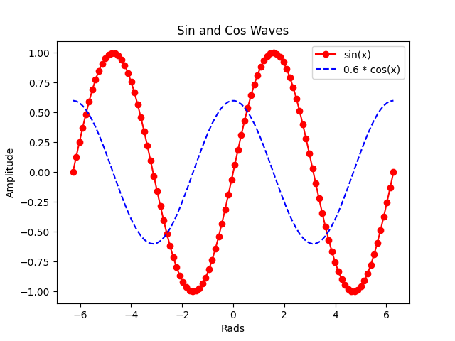
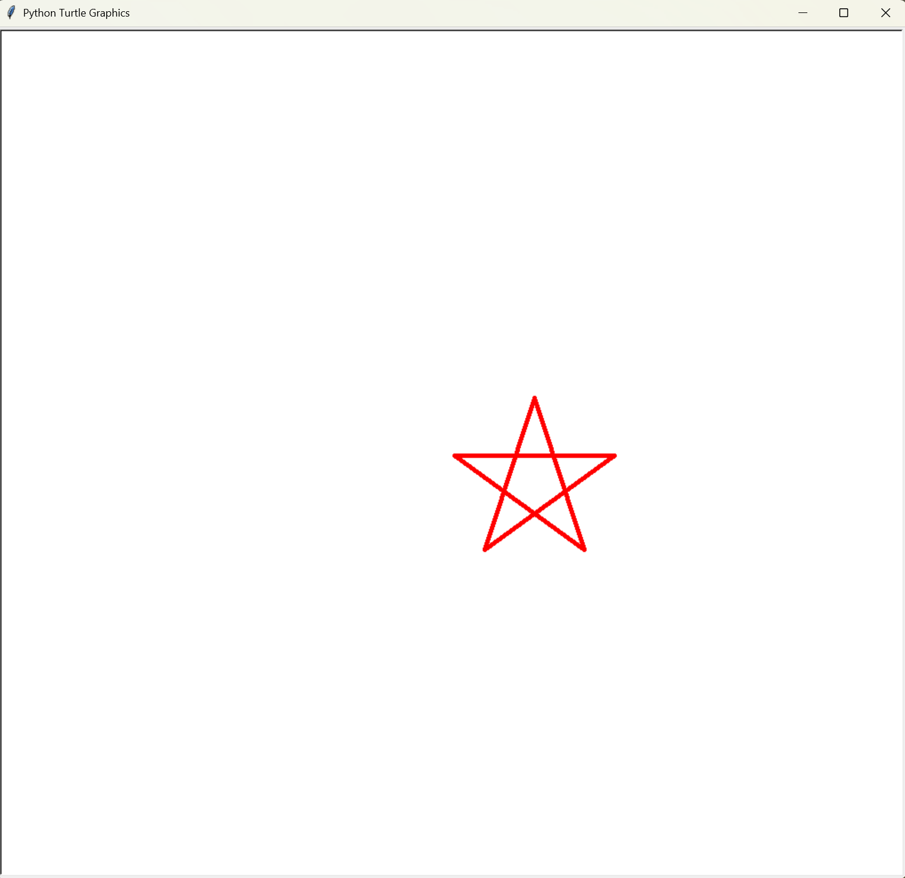

# 【K2】抄写和阅读代码

---

## 1. triangle.py （基础版）

### 代码

```python
# 三角形图案绘制程序
# 使用 @ 符号绘制等腰三角形，高度由用户输入决定

# 获取用户输入的三角形大小（3~20）
n = int(input("Please input size(3~20):"))

# 外层循环控制三角形的行数，共n行
for i in range(n):
    # 每行由两部分组成：前导空格 + @符号
    # 空格数量：n - i - 1（逐行递减）
    # @符号数量：i * 2 + 1（逐行递增，保证等腰）
    line = " " * (n - i - 1) + "@" * (i * 2 + 1)
    # 打印当前行
    print(line)
```

### 运行结果示例

```
Please input size(3~20):5
    @
   @@@
  @@@@@
 @@@@@@@
@@@@@@@@@
```

> **注意**：如果输入值不在 3~20 范围内，程序不会报错，但输出结果可能不符合预期（如输入 2 只显示一行，输入 0 无任何输出）。

---

## 2. triangle_improve.py （改进版）

### triangle_improve.py 比 triangle.py 更好的原因

| 方面 | triangle.py | triangle_improve.py |
|------|-------------|---------------------|
| **输入验证** | 无验证，输入错误值会导致异常或不正确输出 | 添加了 `while` 循环验证，确保输入在 3~20 范围内 |
| **用户体验** | 用户输入无效值时程序直接崩溃或输出异常 | 提示用户重新输入，并告知正确的取值范围 |
| **健壮性** | 较低，容易因用户误输入导致错误 | 较高，能处理超出范围的输入 |

### 代码

```python
# 三角形图案绘制程序（改进版）
# 添加了输入验证，确保用户输入的数值在3~20范围内

# 获取用户输入的三角形大小
n = int(input("Please input size(3~20):"))

# 输入验证循环：当输入值不在3~20范围内时，提示用户重新输入
while n < 3 or n > 20:
    print(f"{n} is not in range! Please input a number between 3 and 20.")
    n = int(input("Please input size(3~20):"))

# 外层循环控制三角形的行数，共n行
for i in range(n):
    # 每行由两部分组成：前导空格 + @符号
    # 空格数量：n - i - 1（逐行递减）
    # @符号数量：i * 2 + 1（逐行递增，保证等腰）
    line = " " * (n - i - 1) + "@" * (i * 2 + 1)
    # 打印当前行
    print(line)
```

### 运行结果示例

```
Please input size(3~20):25
25 is not in range! Please input a number between 3 and 20.
Please input size(3~20):5
    @
   @@@
  @@@@@
 @@@@@@@
@@@@@@@@@
```

---

## 3. guess.py - 猜数字游戏

### 代码

```python
# 猜数字游戏
# 程序随机生成一个1~100之间的数字，玩家有6次机会猜测

# 导入随机模块
import random

# 生成1~100之间的随机整数作为秘密数字
secret = random.randint(1, 100)

# 打印游戏规则说明
print(
    """Guess the number! 
    I think of a number between 1 and 100. You have 6 chances to guess it right.
    """
)

# 初始化猜测次数
tries = 1

# 循环进行最多6次猜测
while tries <= 6:
    # 获取用户输入的猜测值
    guess = int(input("Please input your guess: "))
    
    # 判断猜测结果
    if guess == secret:
        # 猜对了，输出成功信息并退出循环
        print("You guessed it right!")
        break
    elif guess < secret:
        # 猜小了，提示用户
        print("Your guess is too low.")
    else:
        # 猜大了，提示用户
        print("Your guess is too high.")
    
    # 猜测次数加1
    tries += 1
else:
    # 6次机会用完仍未猜对，输出失败信息
    print("Sorry, you didn't guess it right.")
```

### 运行结果示例

```
Guess the number! 
    I think of a number between 1 and 100. You have 6 chances to guess it right.
    
Please input your guess: 50
Your guess is too low.
Please input your guess: 75
Your guess is too high.
Please input your guess: 63
Your guess is too low.
Please input your guess: 69
Your guess is too high.
Please input your guess: 66
Your guess is too low.
Please input your guess: 68
You guessed it right!
```

---

## 4. sincos.py - 正弦余弦波形图

### 代码

```python
# 正弦和余弦波形绘制程序
# 使用matplotlib库绘制sin(x)和0.6*cos(x)的波形图

# 导入matplotlib绘图库和numpy数值计算库
import matplotlib.pyplot as plt
import numpy as np

# 生成x轴数据：从-2π到2π，共100个点
x = np.linspace(-2 * np.pi, 2 * np.pi, 100)

# 绘制sin(x)曲线，红色实线带圆圈标记，图例为"sin(x)"
plt.plot(x, np.sin(x), 'r-o', label="sin(x)")

# 绘制0.6*cos(x)曲线，蓝色虚线，图例为"0.6 * cos(x)"
plt.plot(x, 0.6 * np.cos(x), 'b--', label="0.6 * cos(x)")

# 显示图例
plt.legend()

# 设置x轴标签
plt.xlabel("Rads")

# 设置y轴标签
plt.ylabel("Amplitude")

# 设置图表标题
plt.title("Sin and Cos Waves")

# 显示图形
plt.show()
```

### 运行结果



---

## 5. star.py - 五角星绘制

### 代码

```python
# 五角星绘制程序
# 使用turtle库绘制一个红色的五角星

# 导入turtle绘图库
import turtle

# 获取用户输入的五角星大小（20~200）
size = int(input("Please input size(20~200):"))

# 创建一个turtle对象
t = turtle.Turtle()

# 设置画笔颜色为红色
t.color("red")

# 设置画笔粗细为5
t.pensize(5)

# 循环5次绘制五角星的5条边
for i in range(5):
    # 向前移动size距离
    t.forward(size)
    # 向右旋转144度（五角星的内角角度）
    t.right(144)

# 隐藏turtle光标
t.hideturtle()

# 保持图形窗口显示，等待用户关闭
turtle.done()
```

### 运行结果示例

```
Please input size(20~200):180
```

程序运行后会弹出一个图形窗口，显示一个红色的五角星：



---

## 6. func.py - 二次函数计算器

### 代码

```python
# 二次函数计算器
# 计算二次函数 y = ax² + bx + c 的值，其中a=2, b=-45, c=13

# 获取用户输入的x值
x = float(input("Please input a number: "))

# 定义二次函数的系数
a = 2      # x²项的系数
b = -45    # x项的系数
c = 13     # 常数项

# 计算二次函数的值
y = a * x**2 + b * x + c

# 输出结果
print("x = ", x)
print("y = ", y)
```

### 运行结果示例

```
Please input a number: 10
x =  10.0
y =  -237.0
```

---

## 7. drink.py - 随机酒吧模拟

### 代码

```python
# 随机酒吧模拟程序
# 随机选择饮料并计算消费金额和捐赠金额

# 导入随机模块
import random

# 初始化随机数生成器
random.seed()

# 定义饮料菜单列表
menu = ['cola','milk', 'tea', 'coffee','water','juice']

# 打印欢迎界面
print("~=" * 12)
print("Welcome to Random Bar!")
print("~=" * 12)

# 获取顾客姓名
guest = input("Please input your name: ")

# 随机选择一杯饮料
drink = random.choice(menu)

# 打印点单结果
print("-*-" * 10)
print(f"Hello, {guest}! Enjoy your {drink}.")

# 随机生成消费金额（0~5美元）
cost = random.randrange(6)

# 计算捐赠金额：消费金额的3% + 0.01美元
donation = cost * 0.03 + 0.01

# 根据消费金额输出不同提示
if cost == 0:
    print("It's free!")
else:
    print(f"${cost} please.")

# 输出捐赠金额（保留两位小数）
print(f"We'll donate ${donation:.2f} to the charity.")
```

### 运行结果示例

```
~=~=~=~=~=~=~=~=~=~=~=~=
Welcome to Random Bar!
~=~=~=~=~=~=~=~=~=~=~=~=
Please input your name: Alice
-*-*-*-*-*-*-*-*-*-*-*-*-
Hello, Alice! Enjoy your tea.
$3 please.
We'll donate $0.10 to the charity.
```

---

## 文件清单

| 序号 | 文件名称 | 功能描述 |
|------|----------|----------|
| 1 | `triangle.py` | 三角形绘制（基础版） |
| 2 | `triangle_improve.py` | 三角形绘制（带输入验证） |
| 3 | `guess.py` | 猜数字游戏 |
| 4 | `sincos.py` | 正弦余弦波形图 |
| 5 | `star.py` | 五角星绘制 |
| 6 | `func.py` | 二次函数计算器 |
| 7 | `drink.py` | 随机酒吧模拟 |
