# 【K3】数据类型思考题

## 1. 商品信息的数据分析
便利店进货串点中有80串白萝卜，进货价格0.8元。请指出其中包含的数据和数据类型，编写程序验证下吧。

```python
print(type(80))
print(type(0.8))
```

(运行结果截图)
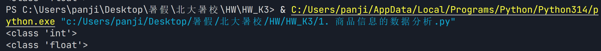

## 2. 便利店里的数据分析 
在便利店里，或网上商城找一种商品，进行数据分析。

- 指出6项以上的数据项；
- 指出这些数据项对应的基本数据类型。

请以**表格**方式列出这些数据项的名称，数据类型和数据值。
| 序号 | 数据项 | 类型 | 数据值 |
| --- | --- | --- | --- |
| 1 | 矿泉水 | str | 矿泉水 |
| 2 | 商品条码 | str | 6922255400784 |
| 3 | 商品产地 | str | 河北省唐山市 |
| 4 | 净含量（克） | float | 100.5 |
| 5 | 商品单价（元） | float | 1.5 |
| 6 | 库存数量 | int | 50 |
| 7 | 是否促销 | bool | True |
| 8 | 保质期天数 | int | 360 |

## 3. 不同的数据对象
对象

标识（id）相同的才是同一个数据对象。一般来说，即便是值相等的数据，也不是同一个数据对象。
例如同样的小数`3.5`，先后赋值给不同的名字（变量），会得到不同的数据对象（id不同），
编写程序验证下吧。

```python
x = 3.5
y = float('3.5')
print(f"x = {x}, id(x) = {id(x)}")
print(f"y = {y}, id(y) = {id(y)}")
print(f"x == y: {x == y}")
print(f"x is y: {x is y}")
print()
print("结论：即便是值相等的数据（3.5 == 3.5），也可能是不同的对象（id不同）")
```

(运行结果截图)
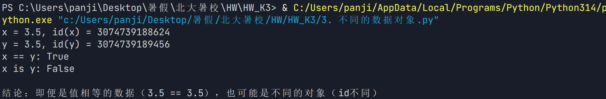

## 4. 变量值交换
如果不用分解赋值的形式，如何才能实现两个变量交换值呢？
编写程序验证下吧。

```python
a = 3
b = 5
print(f"initial_a = {a}, initial_b = {b}")
c = a
a = b
b = c
print(f"final_a = {a}, final_b = {b}")
```
(运行结果截图)
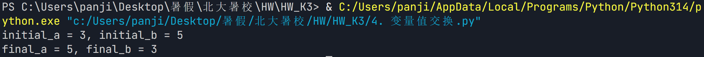

## 5. 便利店欢迎程序

小明同学在为便利店设计一个欢迎程序，在用户输入自己的中文姓名后，程序会提取用户的姓（假设是单字），显示一个亲切的欢迎消息。
- 例如，输入“李清照”，程序显示“小李你好！欢迎来到便利店！”。

请编写程序试一试吧。

```python
name = input("请输入你的名字：")
surname = name[0]
print(f"小{surname}你好！欢迎来到便利店！")
```
(运行结果截图)
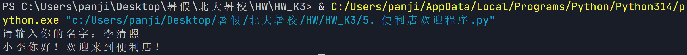

## 6. 拼接和弦
《两只老虎》吉他弹唱的和弦是“CCCCCCGCGC”，如何用拼接和重复运算生成这个字符串？
请编写程序试一试吧。

```python
chord = "C" * 6 + "GC" * 2
long_chord = chord
long_chord += chord
print(long_chord)
```
(运行结果截图)
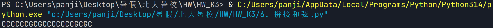

## 7. 奶茶标签
便利店的奶茶价签是这样的字符串
- `品名：浓香原味奶茶；产地：中国；单位：瓶；原价：10.50元；促销价：5.25元`

请编写程序，从价钱字符串中提取**品名**和**促销价**，并打印显示。

```python
label = "品名：浓香原味奶茶；产地：中国；单位：瓶；原价：10.50元；促销价：5.25元"
name = label[3:9]
print(f"品名：{name}")

price = label[-5:-1]
print(f"促销价：{price}元")
```

(运行结果截图)
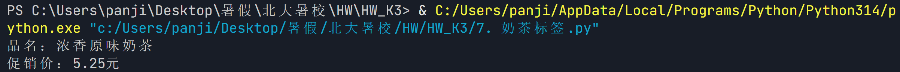

## 8. 推敲
“推敲”一词源于诗人贾岛修改诗句“鸟宿池边树，僧推月下门”的故事。
请你写一段程序，将这句诗关键部分用字符串替换功能改为我们熟悉的名句

```python
poem = "鸟宿池边树，僧推月下门。"
poem_2 = poem.replace("僧推","僧敲")
print(poem_2)
```

(运行结果截图)
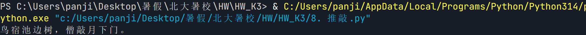

## 9. VIP会员
购买了牛肉串和矿泉水的小强同学是便利店的VIP会员，全单享受九折优惠，他的会员卡里还有5.3元余额。
请问小强同学最终要支付多少钱？
编写程序计算下吧。

```python
beef_price = 5.0
water_price = 2.0
total = beef_price + water_price
is_vip = True
balance = 5.3

if is_vip:
    pay = total * 0.9
else:
    pay = total

final_pay = pay - balance
print(f"牛肉串：{beef_price}元")
print(f"矿泉水：{water_price}元")
print(f"原价合计：{total}元")
print(f"VIP九折后：{pay}元")
print(f"扣除会员卡余额{balance}元")
print(f"最终支付：{final_pay}元")
```

(运行结果截图)
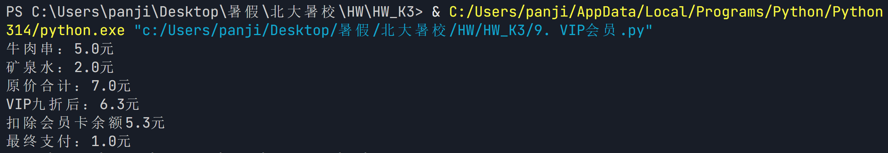

## 10. 正整数的位数
要判断一个正整数n有几位，可以采用的算法是：
> 先求n的以10为底的对数，再用floor取对数值的“地板”整数，最后加1。

请编写程序验证下`2035`和`32768`的位数。

```python
x = int(input("请输入一个正整数："))
import math
print(f"{x}的位数为：{math.floor(math.log10(x)) + 1}")
```

(运行结果截图)
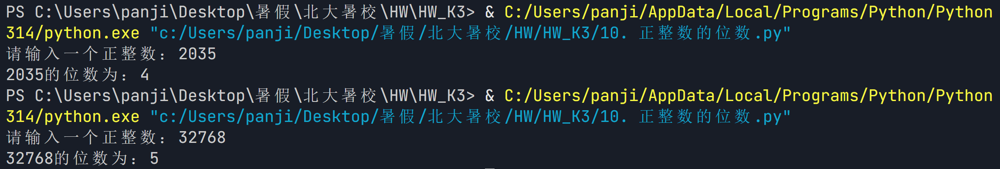

## 11. 串点售价
店员小王正在给进货的串点标记售价，串点售价是在进价的基础上加20%，四舍五入到角，但不超过3.5元
那么：
- 牛肉串的进价是3.0元，售价是多少？
- 如果进价是2.8元呢？

请编写程序验证下吧（提示：用min()函数）

```python
x = float(input("进价："))
price = x * 1.2
if price > 3.5:
    price = 3.5
print(f"售价：{round(price, 1)}元")
```

(运行结果截图)
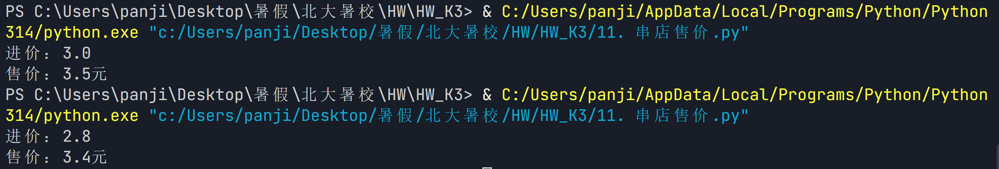

## 12. 自动计算折扣
小明同学提议将计算VIP会员折扣自动化，店员小王输入打折前的金额，程序会自动按照VIP会员的九折，四舍五入到角，打印输出。
> 例如：输入23.7，打印输出21.3。

请编写一个这样的程序吧。

```python
x = float(input("请输入价："))
vip_input = input("是否为VIP会员（是/否）：")
is_vip = vip_input == "是"
if is_vip:
    pay = x * 0.9
else:
    pay = x
print(f"折扣后的价：{round(pay, 1)}元")
```

(运行结果截图)
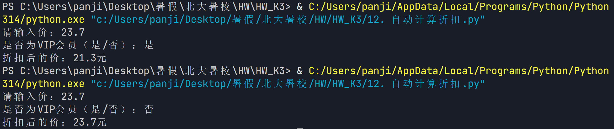

## 13. 浮点数位数
在格式化字符串中，如果浮点数指定的小数点位数比数据对象的位数要少的话，是简单地截断还是四舍五入？
请编写一个程序验证下吧。

```python
num = 3.1415926
print(f"原始值：{num}")
print(f"保留1位小数：{num:.1f}")
print(f"保留2位小数：{num:.2f}")
print(f"保留3位小数：{num:.3f}")
print(f"保留4位小数：{num:.4f}")
print("结论：浮点数格式化时会进行四舍五入，不是简单截断")
```

(运行结果截图)
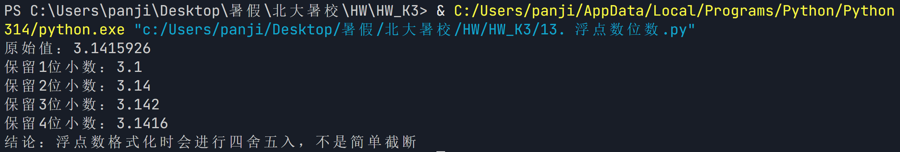

## 14. 海龟作图练习
根据实践项目中的代码框架提示，补充作图语句，完成绘制各种图形的程序。

### 14.1 蓝色等边三角形

```python
import turtle

t = turtle.Turtle()
t.color("blue")
t.pensize(5)
for _ in range(3):
    t.forward(150)
    t.left(120)

turtle.done()
```

(运行结果截图)
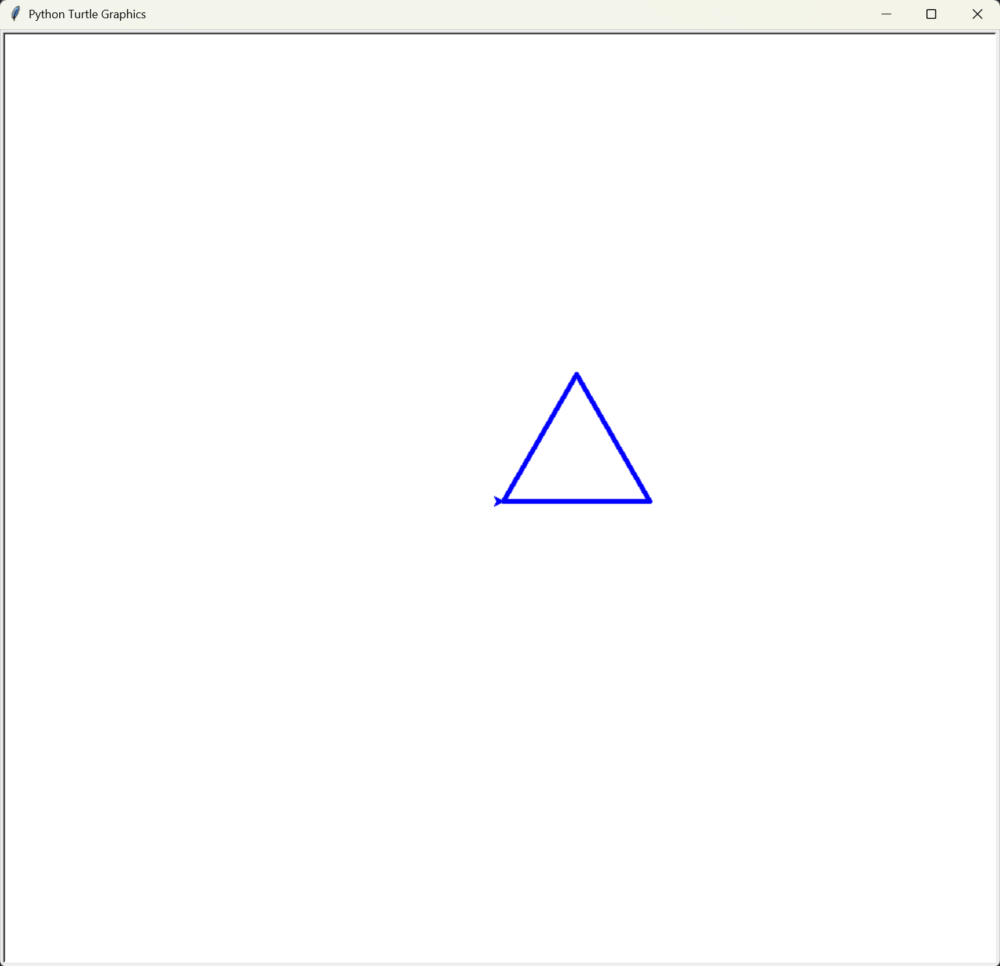

### 14.2 红心

```python
import turtle

t = turtle.Turtle()
t.color("red")
t.begin_fill()
t.left(50)
t.forward(133)
t.circle(50, 200)
t.right(140)
t.circle(50, 200)
t.forward(133)
t.end_fill()

turtle.done()
```

(运行结果截图)
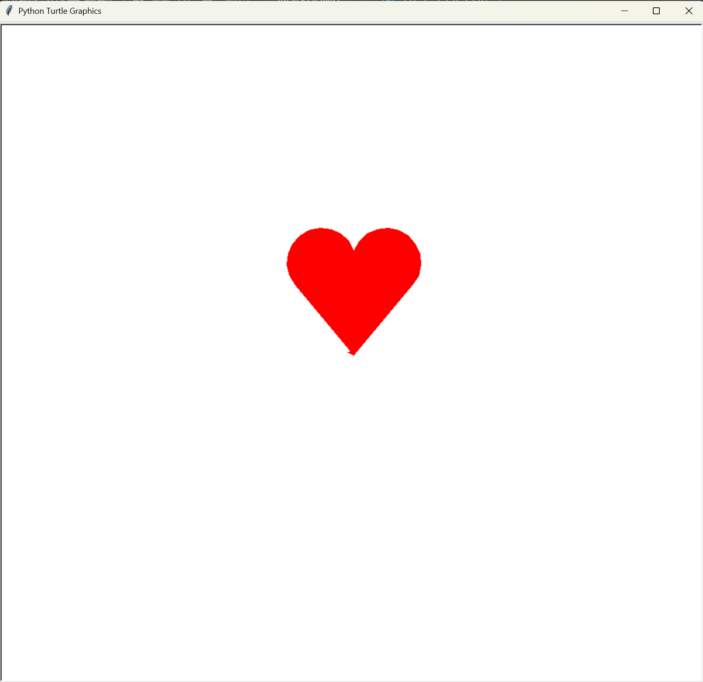

### 14.3 绿色晶体

```python
import turtle

t = turtle.Turtle()
t.color("green")
t.pensize(3)

t.left(30)
t.forward(80)
t.left(120)
t.forward(80)
t.left(60)
t.forward(80)
t.left(120)
t.forward(80)

t.right(60)
t.forward(80)

t.left(120)
t.forward(80)
t.left(60)
t.forward(80)
t.left(120)
t.forward(80)

t.right(60)
t.forward(80)
t.left(120)
t.forward(80)
t.left(60)
t.forward(80)
t.left(120)
t.forward(80)

turtle.done()
```

(运行结果截图)
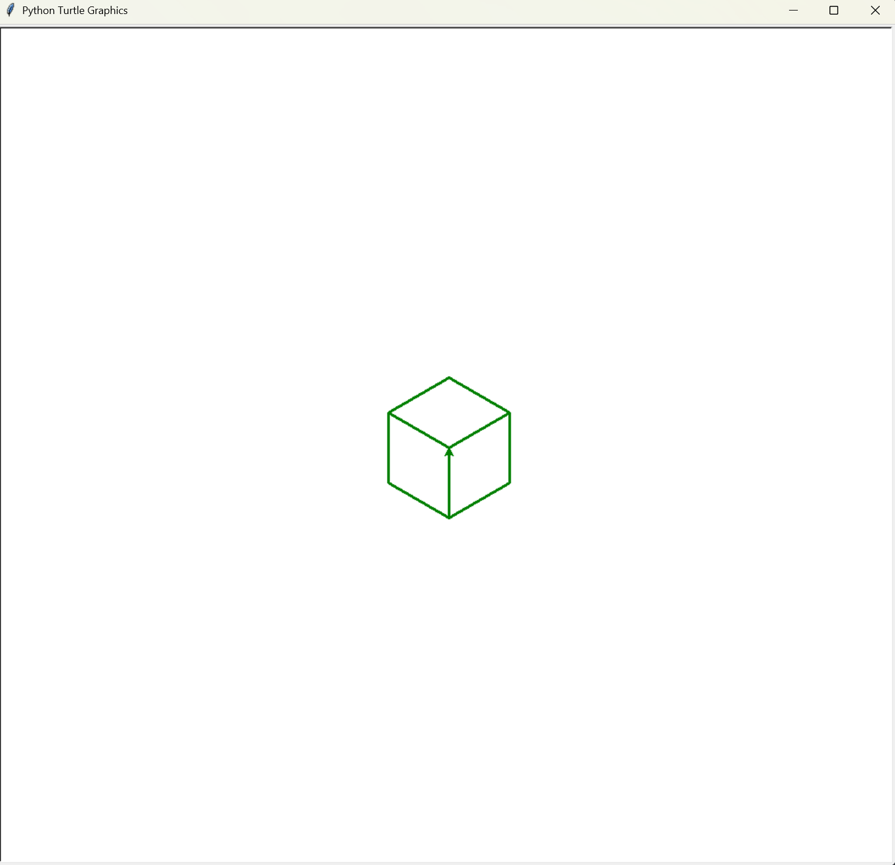

### 14.4 砚台

```python
import turtle

t = turtle.Turtle()
t.speed(2)


t.color("black")
t.begin_fill()
for _ in range(4):
    t.forward(200)
    t.left(90)
t.end_fill()

t.penup()
t.forward(180)
t.left(90)
t.forward(100)
t.pendown()
t.color("gray")
t.begin_fill()
t.circle(80)
t.end_fill()

turtle.done()
```

(运行结果截图)
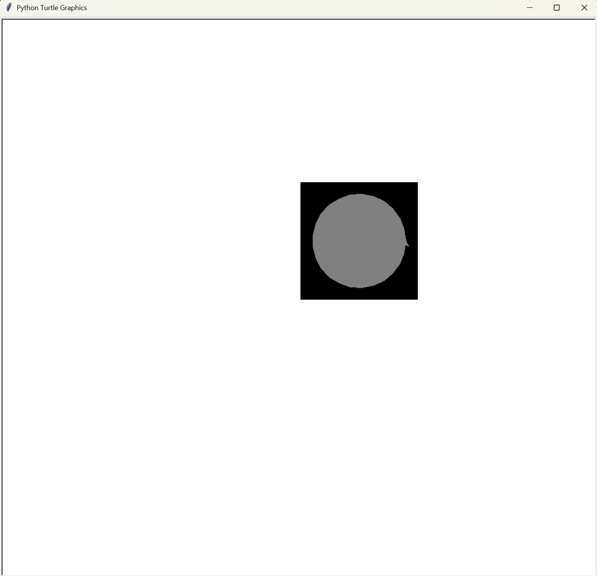

### 14.5 太极图

```python
import turtle

t = turtle.Turtle()
t.speed(2)
t.pensize(3)

t.color("black")
t.begin_fill()
t.circle(100,180)
t.end_fill()

t.circle(100,180)

t.penup()
t.left(90)
t.forward(100)
t.right(90)
t.pendown()
t.color("white")
t.begin_fill()
t.circle(50, 180)
t.end_fill()

t.penup()
t.left(90)
t.forward(100)
t.right(90)
t.pendown()
t.color("black")
t.begin_fill()
t.circle(50, 180)
t.end_fill()

t.penup()
t.left(90)
t.forward(40)
t.right(90)
t.pendown()
t.color("white")
t.begin_fill()
t.circle(10)
t.end_fill()

t.penup()
t.left(90)
t.forward(100)
t.right(90)
t.pendown()
t.color("black")
t.begin_fill()
t.circle(10)
t.end_fill()

t.penup()
t.left(90)
t.forward(60)
t.left(90)
t.pendown()
t.circle(100)


turtle.done()
```

(运行结果截图)
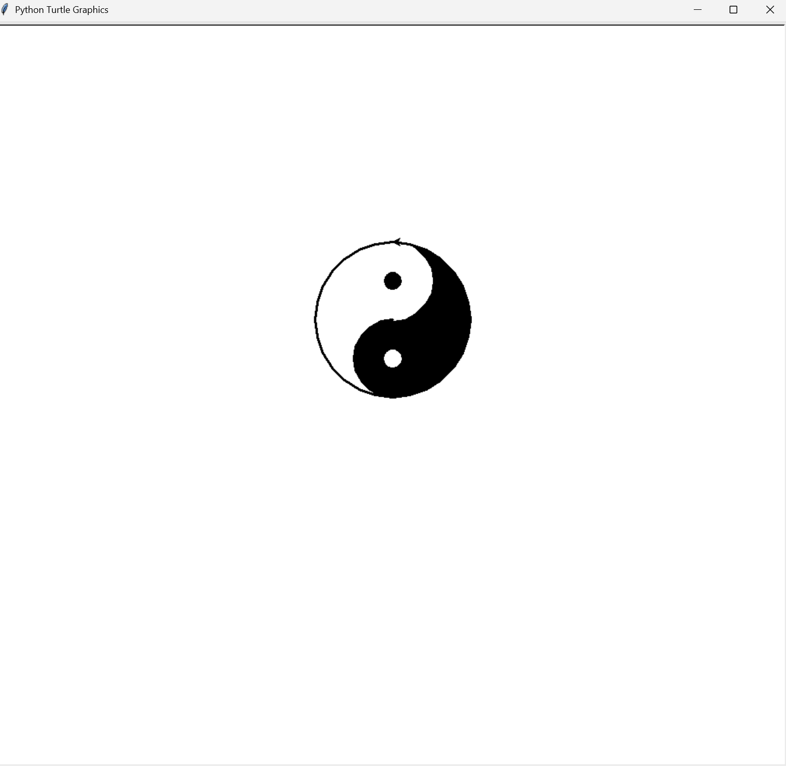

## 15. 绘制三角警示牌
参考海龟函数
- 填充：begin_fill, end_fill
- 画圆：circle、画点：dot

编写海龟作图程序，绘制一个边长可以在100～300之间任意取值的三角警示牌。由变量n来控制边长大小。

画得接近目标图就好，n在指定范围变化的时候，绘制出的不同大小三角警示牌要保持不变形。

```python
import turtle
import numpy as np
import random

t = turtle.Turtle()
t.speed(2)
t.pensize(3)

n = int(input("请输入边长n（100-300）："))
if n < 100 or n > 300:
    print("边长必须在100-300之间")
else:
    t.color('yellow')
    t.begin_fill()
    t.forward(n)
    t.left(120)
    t.forward(n)
    t.left(120)
    t.forward(n)
    t.end_fill()

    t.color('black')
    t.begin_fill()
    t.left(120)
    t.forward(n)
    t.left(120)
    t.forward(n)
    t.left(120)
    t.forward(n)

    t.penup()
    t.left(150)
    t.forward(np.sqrt(3)*n/16)
    t.left(30)
    t.pendown()
    t.forward(n-3*n/16)
    t.right(120)
    t.forward(n-3*n/16)
    t.right(120)
    t.forward(n-3*n/16)
    t.end_fill()

    t.penup()
    t.right(180)
    t.forward(13*n/32)
    t.left(90)
    t.forward(n/8)
    t.pendown()
    t.dot(n/12)

    t.penup()
    t.forward(n/12)
    t.left(10)
    t.pendown()
    t.color('black')
    t.begin_fill()
    t.forward(n/4)
    t.right(100)
    t.forward(n/12)
    t.right(100)
    t.forward(n/4)
    t.end_fill()

    t.penup()
    t.right(160)
    t.forward(n/4)
    t.right(10) 
    t.pendown()

    t.color('black')
    t.begin_fill()
    t.circle(-n/24,180)
    t.end_fill()    

turtle.done()
```

(运行结果截图1，n=100)
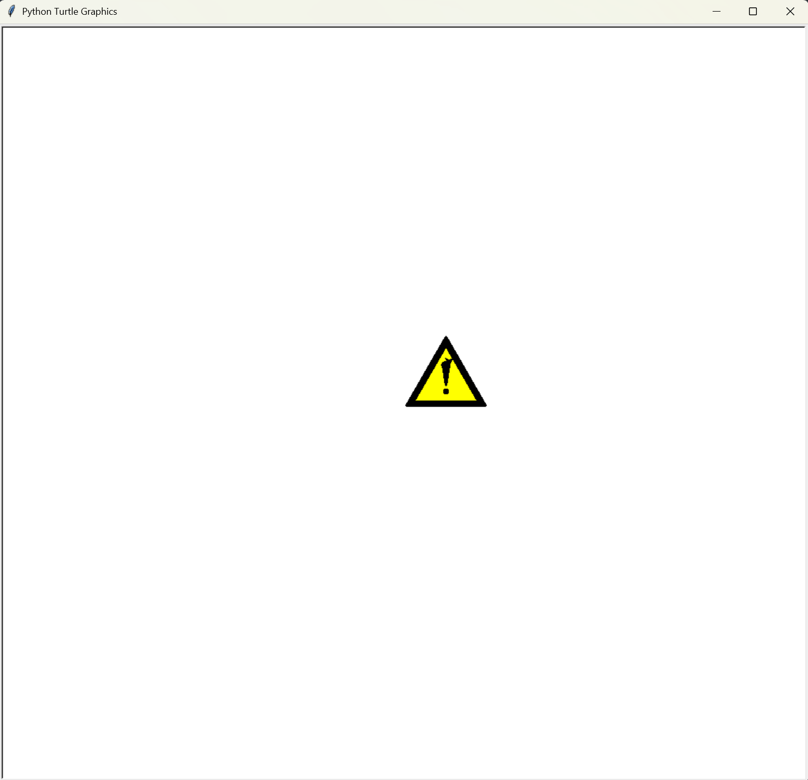
(运行结果截图2，n=160)
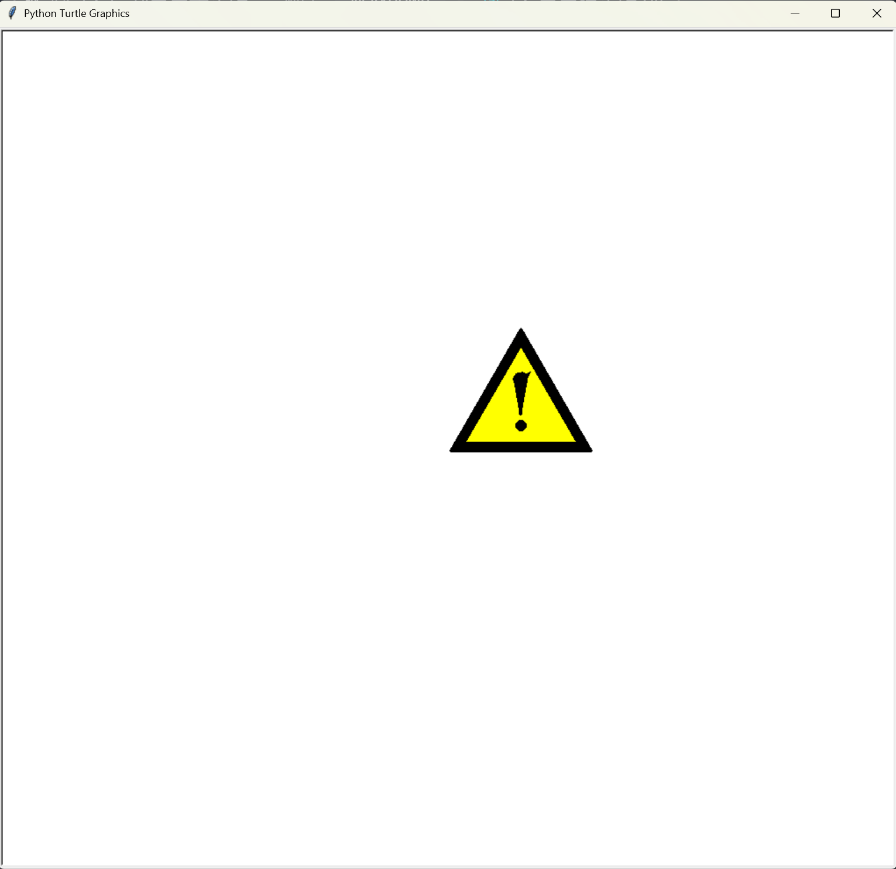
(运行结果截图3，n=220)
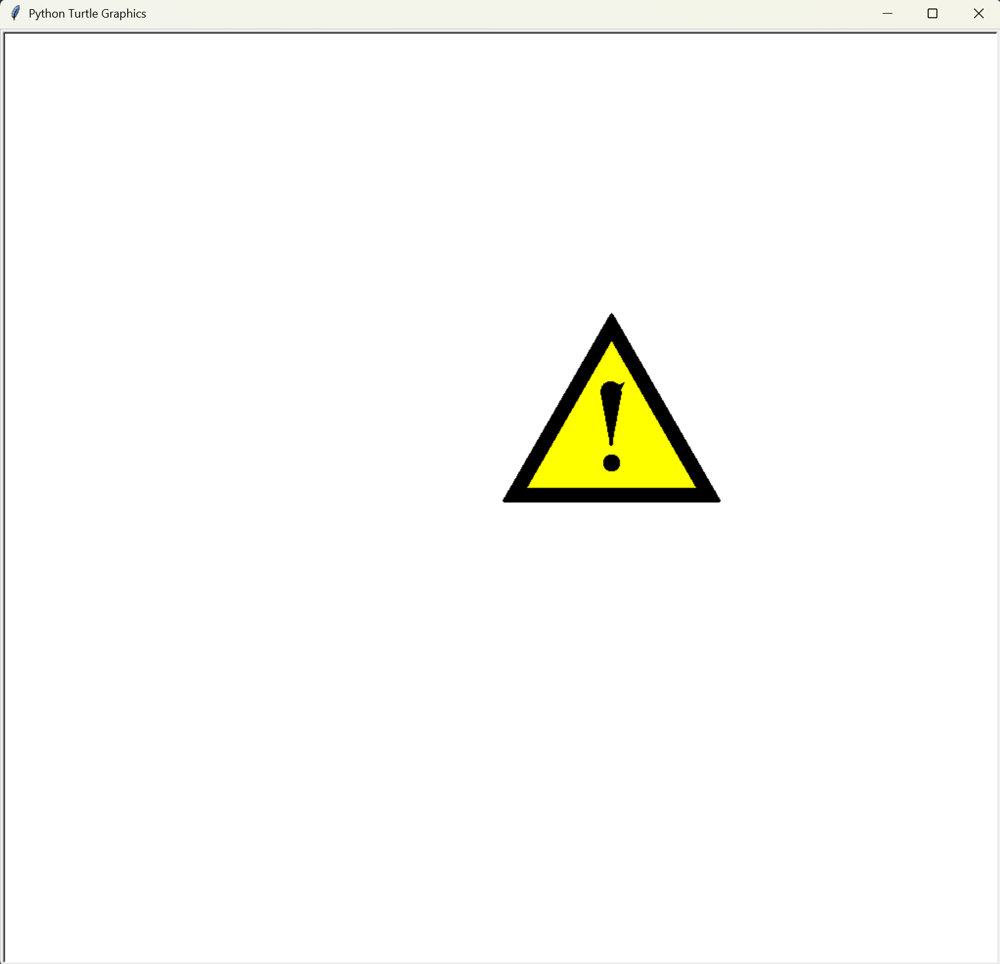
(运行结果截图4，n=300)
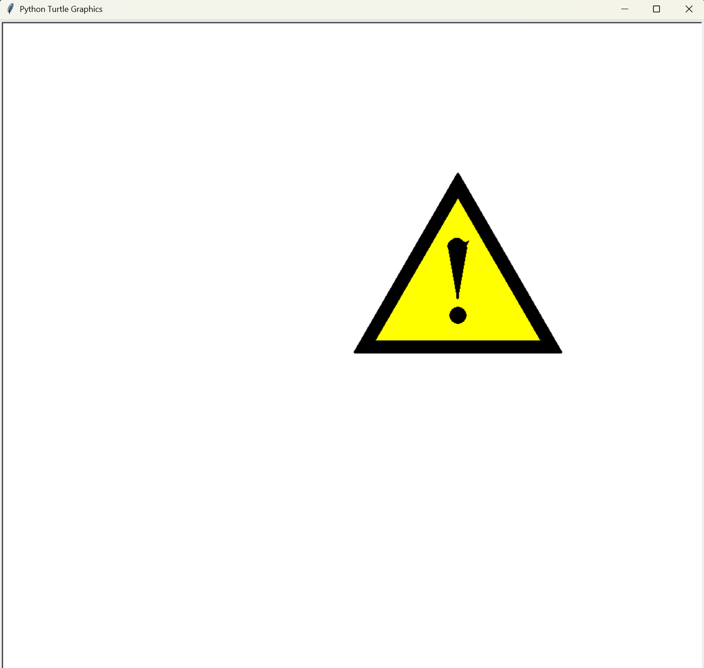

## 16. 两种状态的事情
在便利店应用场景或学习生活中，还有哪些事情是恰好两种状态的？请举几个例子。

（答案写这里）
**便利店场景**
1. 商品是否过期
2. 商品是否被购买
3. VIP是否续费
4. 顾客是否需要袋子
5. 顾客是否需要用现金支付

**学习生活场景**
1. 作业是否完成
2. 考试是否及格
3. 是否佩戴眼镜
4. 是否吃过早饭
5. 是否看过群公告

## 17. 优惠活动
便利店的优惠活动还在继续，规则改为“**VIP会员全单九折，普通会员串点九折**”，
请你写一段程序，让店员小王先输入会员号，再输入商品名称，打印出是否享受优惠，享受九折优惠打印`True`，否则打印`False`。
> 提示，用两个`input()`函数分别得到会员号和商品名称

```python
vip_input = input("请输入会员号（VIP会员请输入VIP，普通会员请输入普通）：")
is_vip = vip_input == "VIP"
normal_member = vip_input == "普通"
product = input("请输入商品名称：")
if is_vip:
    print(True)
elif normal_member and product == "串点":
    print(True)
else:
    print(False)
```

(运行结果截图)
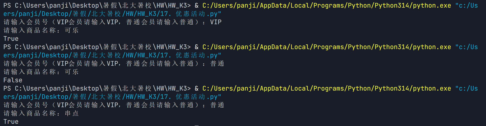

## 18. 周末折扣
便利店的周末折扣是“**全场九折，奶茶和串点八折，VIP会员全场八折**”
请用三元表达式和any()函数写出折扣计算表达式，编写程序试试吧。
> 提示，用两个`input()`函数分别得到会员号和商品名称

```python
vip_input = input("请输入会员号（VIP会员请输入VIP，普通会员请输入普通）：")
product = input("请输入商品名称：")
is_vip = vip_input == "VIP"
discount = 0.8 if is_vip or any(item in product for item in ["奶茶", "串点"]) else 0.9
print(f"折扣为：{discount}")
```

(运行结果截图)
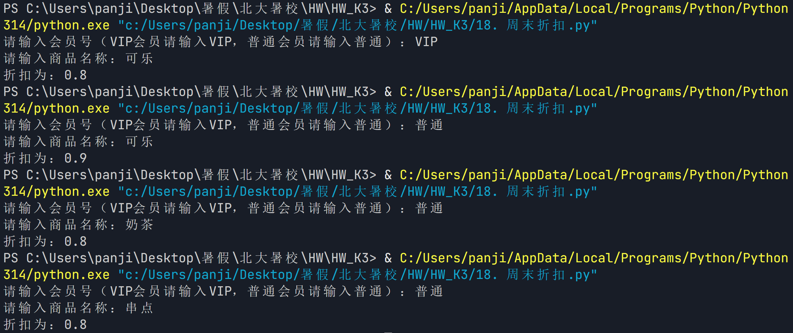

## 19. 基本表达式练习（OJ）
完成OJ编程练习题
- http://python.openjudge.cn/basic_expr/ 

(11题全部通过的表格截图)
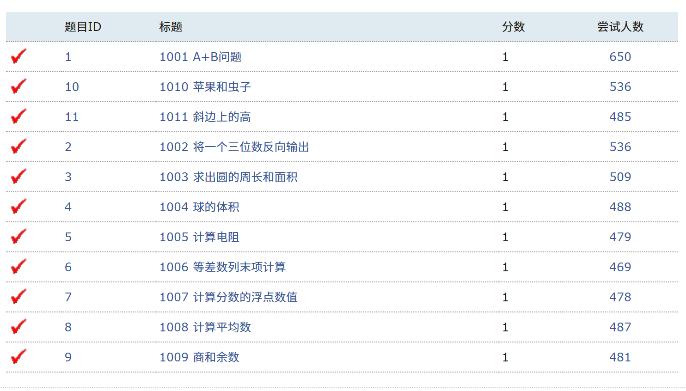

### 19.1 1001 A+B问题

```python
x = int(input(""))
y = int(input(""))
print(x+y)
```

(运行结果截图)
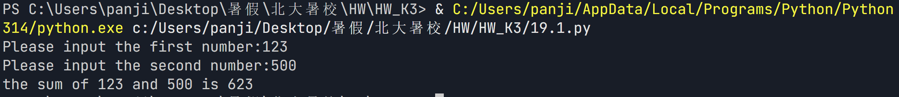

### 19.2 1002 将一个三位数反向输出

```python
x = int(input())
x_rev = int(str(x)[::-1])
print(x_rev)
```

(运行结果截图)
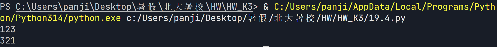

### 19.3 1003 求出圆的周长和面积

```python
pi = 3.14159
r = int(input())
S = pi * r**2
C = 2 * pi * r
print("%.4f" % C + " " + "%.4f" % S)
```

(运行结果截图)
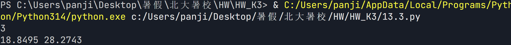

### 19.4 1004 球的体积

```python
n = 3.14
r = int(input())
V = 4 / 3 * n * r**3
print("%.2f" % V)
```

(运行结果截图)
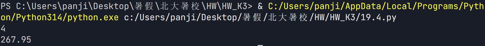

### 19.5 1005 计算电阻

```python
r1 = float(input())
r2 = float(input())
R = 1/(1/r1 + 1/r2)
print("%.2f" % R)
```

(运行结果截图)
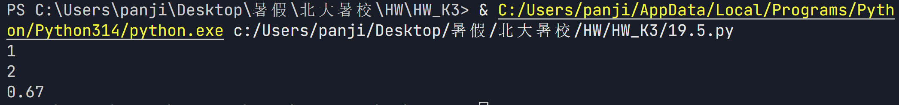

### 19.6 1006 等差数列末项计算

```python
a1 = int(input())
a2 = int(input())
n = int(input())
an = a1 + (n - 1) * (a2 - a1)
print(an)
```

(运行结果截图)
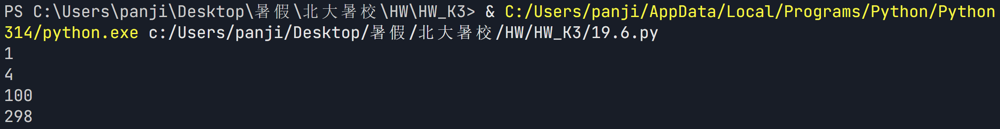

### 19.7 1007 计算分数的浮点数值

```python
a = float(input())
b = float(input())
c = a / b
print("%.9f" % c)   
```

(运行结果截图)
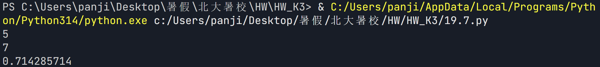

### 19.8 1008 计算平均数

```python
# 程序写这里x = int(input())
y = int(input())
z = int(input())
average = (x + y + z) / 3
print("%.2f" % average)
```

(运行结果截图)
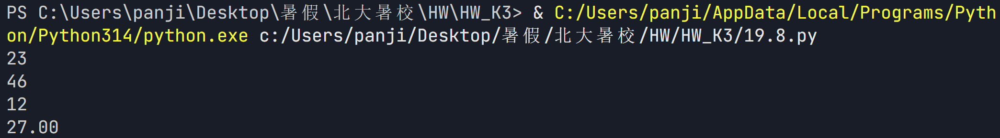

### 19.9 1009 商和余数

```python
a = int(input())
b = int(input())
print(str(a // b) + " " + str(a % b))
```

(运行结果截图)
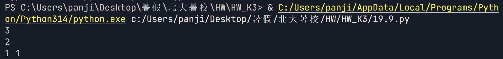

### 19.10 1010 苹果和虫子

```python
import math
n = int(input())
x = int(input())
y = int(input())
if y > n*x:
    print(0)
else:
    remaining = int(n - math.ceil(y/x))
    print(remaining)
```

(运行结果截图)
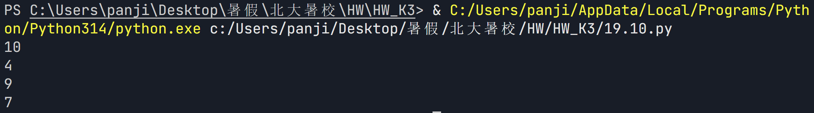

### 19.11 1011 斜边上的高

```python
x = float(input())
y = float(input())
z = (x**2 + y**2) ** 0.5
h = x * y / z
print("%.2f" % h)
```

(运行结果截图)
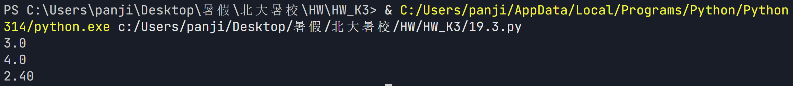