# 【K4】进阶数据类型思考题

## 1. 不同类型元素的列表

是否可以创建一个包含有不同类型数据对象的列表？
- 比如，把姓名（字符串）作为第一个元素，年龄（整数）作为第二个元素，身高（浮点数）作为第三个元素。
请编写程序试一试吧。

```python
lst = ['Peter', 24, 1.75]
print(lst)
```

(运行结果截图)
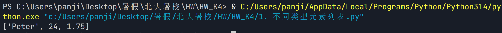

## 2. 列表的变化

如果有一个整数变量a = 10，通过赋值语句b = a，赋值给b。我们知道，后续更新a的值，不会影响到b。
这个结论，对列表类型的变量是否也成立呢？
比如，通过赋值语句b = ages，将年龄列表ages赋值给b，我们对ages列表进行添加、删除和更新元素时，b的值会发生变化吗？
请编写程序试一试吧！

```python
ages = [24, 30, 35, 40]
b = ages

# 操作1: 添加元素
ages.append(45)
print("添加元素后:")
print("  ages:", ages)
print("  b:   ", b)

# 操作2: 更新元素（通过索引赋值）
ages[0] = 25  # 把第一个元素24更新为25
print("\n更新元素后:")
print("  ages:", ages)
print("  b:   ", b)

# 操作3: 删除元素
ages.remove(40)
print("\n删除元素后:")
print("  ages:", ages)
print("  b:   ", b)

print("\n结论：b和ages指向同一个列表对象，")
print("对ages进行任何操作（添加/更新/删除/清空），b都会同步变化。")
```
(运行结果截图)
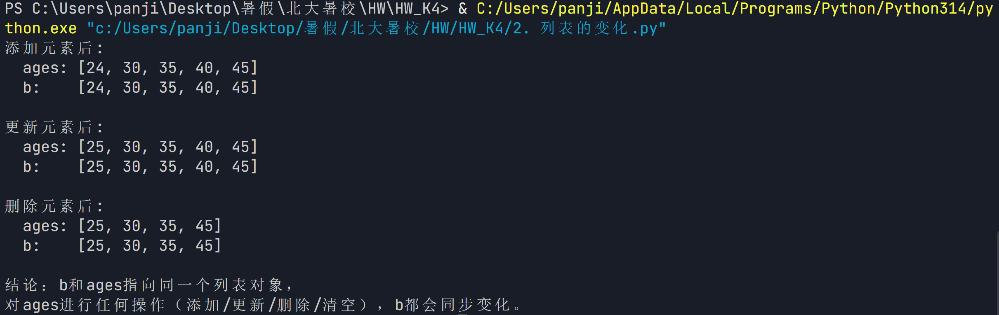

## 3. 切片的位置

切片操作对开始位置、结束位置和步长的宽容度是比较高的。
例如，alist[3:1]、alist[1:3:-1]这样的切片就不太合理。
那么，真这么进行切片的话，会得到什么结果呢？
请编写程序试试吧！

```python
alist = [1, 2, 3, 4, 5, 6, 7, 8, 9]
print(alist[3:1])
print(alist[1:3:-1])
print()
print(f'因为alist[3:1]表示从索引3开始，到索引1结束，步长为1，行进方向和起止顺序矛盾，返回空列表[]')
print(f'因为alist[1:3:-1]表示从索引1开始，到索引3结束，步长为-1，行进方向和起止顺序矛盾，返回空列表[]')
```

(运行结果截图)
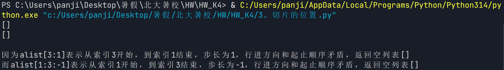

## 4. 索引判断

如果我们要获取数据在列表中的索引位置，但又不能肯定数据一定在列表中，那要怎么做才能避免出现“数据不在列表中”的ValueError错误？

```python
lst = ['apple', 'banana', 'orange', 'grape']
targets = input("请输入要查找的元素（空格分隔）：").split()
for i in targets:
    if i in lst:
        idx = lst.index(i)
        print(f"  '{i}' 在列表中，索引为 {idx}")
    else:
        print(f"  '{i}' 不在列表中")
```

(运行结果截图)
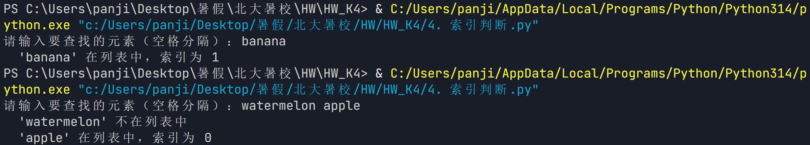

## 5. 列表运算的交换律

我们熟悉的加法乘法运算符，在Python中可以用来很直观地表示列表的合并与重复操作，那么，这两个运算符对列表的运算，是否像整数运算那样满足交换律？
请编写程序试试吧！

```python
lst_1 = [1, 2, 3]
lst_2 = [4, 5, 6]

lst_add_1 = lst_1 + lst_2
lst_add_2 = lst_2 + lst_1
print("列表加法运算:")
print(f"  lst_1 + lst_2 = {lst_add_1}")
print(f"  lst_2 + lst_1 = {lst_add_2}")
if lst_add_1 == lst_add_2:
    print("列表加法运算的交换律成立")
else:
    print("列表加法运算的交换律不成立")

print()

n = 3
lst_mul_1 = lst_1 * n
lst_mul_2 = n * lst_1
print("列表乘法运算:")
print(f"  lst_1 * {n} = {lst_mul_1}")
print(f"  {n} * lst_1 = {lst_mul_2}")
if lst_mul_1 == lst_mul_2:
    print("列表乘法运算的交换律成立")
else:
    print("列表乘法运算的交换律不成立")
```

(运行结果截图)
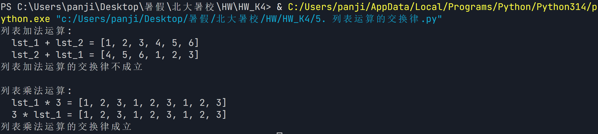

## 6. sort的reverse参数

列表的sort()方法带reverse=True参数，和reverse()方法有什么区别？

```python
lst_1 = [2, 1, 3, 9, 5, 7, 6, 4, 8]
lst_2 = [2, 1, 3, 9, 5, 7, 6, 4, 8]

print("原列表:", lst_1)

lst_1.sort(reverse=True)
print(f'用sort(reverse=True)生成的列表：{lst_1}')

lst_2.reverse()
print(f'用reverse()生成的列表：{lst_2}')
print()
print(f'结论：sort(reverse=True)方法会先对列表进行排序，再将列表反转；而reverse()方法不会对列表进行排序，直接将列表反转。')
```

(运行结果截图)
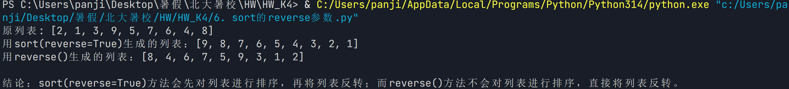

## 7. 列表的聚合函数

这些聚合函数如果对空列表进行统计，会返回什么？
先思考下，再用程序运行验证。

```python
empty_list = []
print("len(empty_list):", len(empty_list))
print("sum(empty_list):", sum(empty_list))
try:
    print("min(empty_list):", min(empty_list))
except:
    print("min(empty_list): ValueError")
try:
    print("max(empty_list):", max(empty_list))
except:
    print("max(empty_list): ValueError")

print("结论:")
print("  len([])返回0")
print("  sum([])返回0")
print("  min([])返回ValueError（空列表无最小值）")
print("  max([])返回ValueError（空列表无最大值）")
```

(运行结果截图)
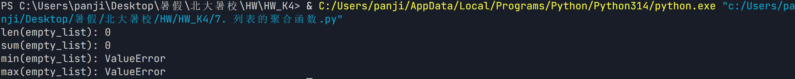

## 8. 元组的更新

既然元组是固定不可变的，如果要更新元组中某个元素的数值，应该怎么做？
直接赋值是不可行的，但可以通过其他功能的组合来实现，
请尝试编程把元组(18, 19, 20, 17)中的20更新为21。

```python
tuple_1 = (18, 19, 20, 17)
lst = list(tuple_1)
lst[2] = 21
tuple_new = tuple(lst)
print(tuple_new)
```

(运行结果截图)
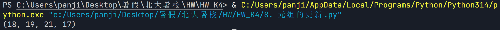

## 9. 查找功能的对比

关于查找功能，字符串要比列表和元组强一些，不光可以查找单个字符在字符串中的存在性和位置，还可以查找多个字符构成的子串。
请编写程序试试吧！

```python
text = "Hello World"
print("字符串查找:")
print(f"text.find('W')   = {text.find('W')}")
print(f"text.find('World') = {text.find('World')}")  
# find()找不到时返回-1
result = text.find('Python')
if result == -1:
    print(f"’Python’不在字符串中。")
else:
    print(f"text.find('Python') = {result}")
```

(运行结果截图)
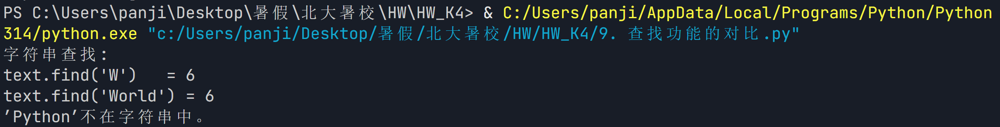

## 10. 字符串创建集合

可以用set()函数从字符串创建一个集合。
结合上一节的内容，请思考：这个集合会包含什么数据元素？这样从字符串创建的集合有什么意义？
请编写程序验证一下。

```python
str = "Hello World"
print("原字符串:", str)
char_set = set(str)
print(f"set(str) = {char_set}")
for i in char_set:
    num = str.count(i)
    print(f"{i} 在字符串中出现了 {num} 次")

print(f"结论：set()函数可以将字符串中出现的字符转换为集合并去重。")
```

(运行结果截图)
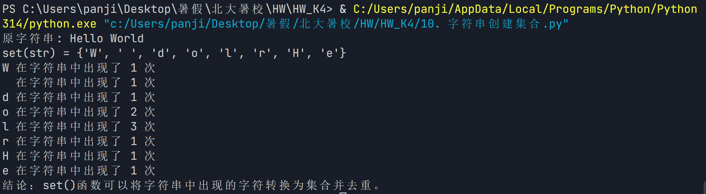

## 11. 集合元素删除次序

集合的pop()方法会删除并返回某个元素，那么它删除的次序会不会跟add()添加元素的次序有关？
请编写程序验证之。

```python
set1 = set()
set1.add('a')
set1.add('b')
set1.add('c')
set1.add('d')
set1.add('e')
add_order = ['a', 'b', 'c', 'd', 'e']
print(f"添加元素的顺序: {add_order}")
print("添加后的集合:", set1)
print("元素的打印顺序可能与添加顺序不同\n")

pop_order = []
while set1:
    elem = set1.pop()
    pop_order.append(elem)
    print(f"  pop() 删除: {elem}")
print(f"删除元素的顺序: {pop_order}")
if {add_order == pop_order} == True:
    print("添加元素的顺序与删除元素的顺序相同")
else:
    print("添加元素的顺序与删除元素的顺序不同")
```

(运行结果截图)
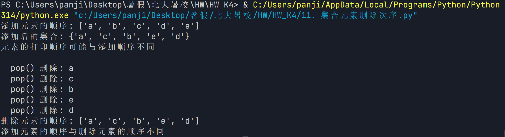

## 12. 集合的关系

如果集合A是集合B的子集，那么`A in B`能得到`True`的结果吗？
请编写程序验证之。

```python
A = {'a', 'b'}
B = {'a', 'b', 'c', 'd'}
print(f"A = {A}")
print(f"B = {B}")

subset = A.issubset(B)
print(f"A 是否是 B 的子集: {subset}")

subset_2 = A in B
print(f"A in B = {subset_2}")

if subset_2 == True:
    print("A 是 B 的一个【子集】")
else:
    print("'A in B' 不能表示 A 是否是 B 的【子集】")
    A_2 = 'a'
    print(f"A_2 = {A_2}")
    print(f"A_2 in B = {A_2 in B}")
    print("'A in B' 可以表示 A 是否是 B 的一个【元素】")
```

(运行结果截图)
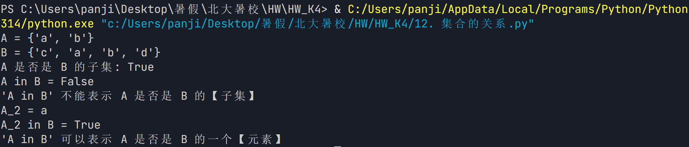

## 13. 集合对称差

集合A、B的并集减去A、B的交集，是不是就等于A、B的对称差？
请编写程序验证一下。

```python
A = {'a','c','e','f'}
B = {'a','b','c','d'}
print(f"A = {A}")
print(f"B = {B}")

C_1 = A.symmetric_difference(B)
print(f"A、B的对称差：C.symmetric_difference(B) = {C_1}")

C_2 = (A | B) - (A & B)
print(f"A、B的并集减去A、B的交集：(A | B) - (A & B) = {C_2}")

if C_1 == C_2:
    print("A、B的并集减去A、B的交集等于A、B的对称差")
else:
    print("A、B的并集减去A、B的交集不等于A、B的对称差")
```

(运行结果截图)
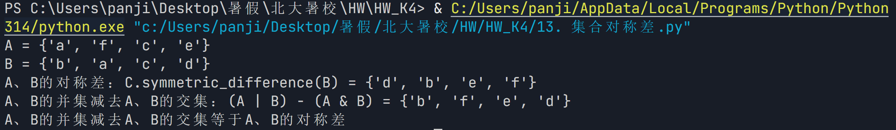

## 14. 字典和集合的相似性

从字典和集合两种容器类型的定义来看，它们存在很多相似性，
请对照归纳并编程验证这种相似性。

```python
# 1. 创建方式相似
print("1. 创建方式相似:")
s = {1, 2, 3}           # 集合字面量
d = {'a': 1, 'b': 2}    # 字典字面量
print(f"  集合 s = {s}")
print(f"  字典 d = {d}")

# 2. 都支持 in 运算符（判断元素/键是否存在）
print("\n2. 都支持 in 运算符:")
print(f"  2 in s = {2 in s}")          # 集合：判断元素
print(f"  'a' in d = {'a' in d}")     # 字典：判断键

# 3. 都支持 len()
print("\n3. 都支持 len():")
print(f"  len(s) = {len(s)}")
print(f"  len(d) = {len(d)}")

# 4. 都是无序的
print("\n4. 都是无序的:")
s2 = {3, 1, 2}
d2 = {'b': 2, 'a': 1}
print(f"  {{3,1,2}} 创建后可能打印为: {s2}")
print(f"  {{'b':2,'a':1}} 创建后可能打印为: {d2}")

# 5. 都支持遍历
print("\n5. 都支持遍历:")
print("  遍历集合: ", end="")
for item in s:
    print(item, end=" ")
print()
print("  遍历字典: ", end="")
for key in d:
    print(key, end=" ")
print()

# 6. 都支持推导式
print("\n6. 都支持推导式:")
s_comp = {x*2 for x in range(5)}
d_comp = {x: x**2 for x in range(5)}
print(f"  集合推导式: {s_comp}")
print(f"  字典推导式: {d_comp}")
```

(运行结果截图)
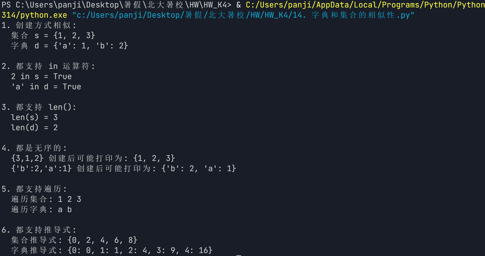

## 15. 添加字典条目

在添加字典条目的操作完成后，如何区分是新建了一个条目，还是更新了一个已有条目？
请编写程序验证之。

```python
student = {}

def add_or_update(dictionary, key, value):
    # 添加前判断key是否存在
    if key in dictionary:
        print(f"更新已有条目：{key} -> {value}")
    else:
        print(f"新建条目：{key} -> {value}")
    
    # 添加或更新
    dictionary[key] = value


# 第一次添加
add_or_update(student, "Tom", 18)

# 第二次添加相同键
add_or_update(student, "Tom", 20)

# 添加新的键
add_or_update(student, "Jack", 22)


print("\n最终字典内容：")
print(student)

print(f'结论：Python 字典在使用赋值语句添加条目时，根据键是否已经存在，会分别执行新增条目或更新条目的操作。不存在则新增，存在则更新。')
```

(运行结果截图)
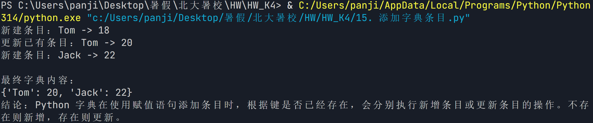

## 16. 字典数据查找

在字典中查找仅限于关键字查找，为什么Python语言不提供在字典条目的数据值中查找的功能呢？
有什么不便之处吗？

（答案写这里）
1. 性能考虑（核心原因）
   - 字典底层是哈希表，键查找通过哈希函数直接定位，时间复杂度 O(1)
   - 值没有建立哈希索引，查找值只能遍历所有条目，时间复杂度 O(n)
   - 如果支持值查找，会破坏字典"高效查找"的设计初衷

2. 值可能不唯一
   - 多个键可能对应相同的值，如 {'a': 1, 'b': 1}
   - 反向查找会返回多个结果，无法像键查找那样确定唯一值

3. 值可能是可变类型
   - 字典的值可以是列表、字典等可变类型
   - 可变类型不可哈希，无法建立反向索引

二、不便之处：

1. 反向查找（按值找键）需要手动遍历，代码较繁琐
2. 频繁的反向查找场景下效率较低

## 17. 字典更新

我们如何知道update()方法批量更新了字典之后新增了多少条目？更新了多少条目？
请编写程序试试吧！提示：用len()函数

```python
original = {'Tom': 18, 'Jack': 20}
print(f"更新前字典: {original}")
print(f"更新前长度: {len(original)}")

new_data = {'Jack': 21, 'Lucy': 19, 'Lily': 22}
print(f"\n要更新的数据: {new_data}")
print(f"要更新的条目数: {len(new_data)}")

before_len = len(original)
original.update(new_data)
after_len = len(original)

added = after_len - before_len
updated = len(new_data) - added

print(f"\n更新后字典: {original}")
print(f"更新后长度: {after_len}")
print(f"\n新增条目数: {added}")
print(f"更新已有条目数: {updated}")
```

(运行结果截图)
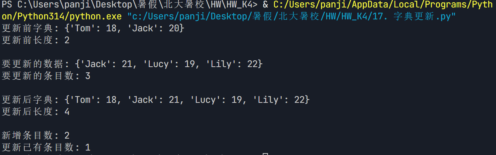

## 18. 三维数组

如果用嵌套列表来表示三维数组，可以怎么做？
请编写程序试试吧！

```python
# 情景：2个班级，每个班级3个学生，每个学生3门课的成绩
scores = [
    [   # 第1个班级
        [85, 90, 78],   # 学生1的3门课成绩
        [76, 88, 95],   # 学生2的3门课成绩
        [90, 85, 82],   # 学生3的3门课成绩
    ],
    [   # 第2个班级
        [70, 75, 80],   # 学生1的3门课成绩
        [92, 88, 76],   # 学生2的3门课成绩
        [85, 90, 95],   # 学生3的3门课成绩
    ],
]

print(f"scores = {scores}")

# 维度信息
print(f"\n维度信息:")
print(f"  层数（班级数）: {len(scores)}")
print(f"  行数（每班学生数）: {len(scores[0])}")
print(f"  列数（每生课程数）: {len(scores[0][0])}")

# 访问元素：scores[层][行][列]
print(f"\n访问元素 scores[层][行][列]:")
print(f"  scores[0][0][0] = {scores[0][0][0]}  (第1班/学生1/第1门课)")
print(f"  scores[0][1][2] = {scores[0][1][2]}  (第1班/学生2/第3门课)")

# 遍历三维数组
print("\n遍历三维数组:")
for i, classroom in enumerate(scores):
    print(f"  第{i+1}个班级:")
    for j, student in enumerate(classroom):
        print(f"    学生{j+1}的成绩: {student}")
```

(运行结果截图)
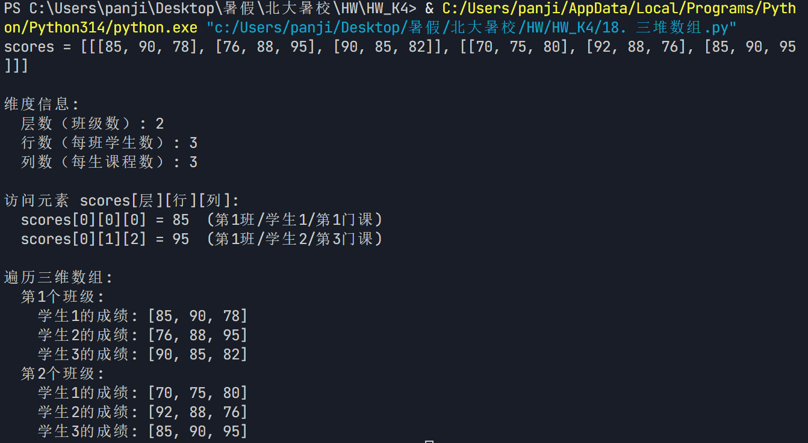

## 19. 记录卡片盒

字典列表可以实现类似记录卡片盒的构造，每个字典对象包含一张卡片的各项信息，这些卡片按照位置顺序存放在卡片盒，以便按索引抽取整张卡片并访问到所有数据项
与字典列表类似的卡片盒构造，也可以通过嵌套列表来实现，请用嵌套列表重写本节的示例程序。

```python
students_dict = [
    {'name': 'Tom', 'age': 18, 'city': '北京'},
    {'name': 'Jack', 'age': 20, 'city': '上海'},
    {'name': 'Lucy', 'age': 19, 'city': '广州'},
]

students_list = [
    ['Tom',  18, '北京'],   # 第1张卡片
    ['Jack', 20, '上海'],   # 第2张卡片
    ['Lucy', 19, '广州'],   # 第3张卡片
]

print("字典列表")
print(students_dict)

print("\n嵌套列表")
print(students_list)

print("\n按索引抽取整张卡片:")
print(f"第2张卡片（dict）: {students_dict[1]}")
print(f"第2张卡片（list）: {students_list[1]}")

print("\n访问卡片中的数据项:")
print(f"第2张卡片的姓名（dict）: {students_dict[1]['name']}")
print(f"第2张卡片的姓名（list）: {students_list[1][0]}")

# 3. 遍历所有卡片
print("\n遍历所有卡片:")
print("dict:")
for card in students_dict:
    print(f"姓名:{card['name']}, 年龄:{card['age']}, 城市:{card['city']}")

print("list:")
for card in students_list:
    print(f"姓名:{card[0]}, 年龄:{card[1]}, 城市:{card[2]}")
```

(运行结果截图)
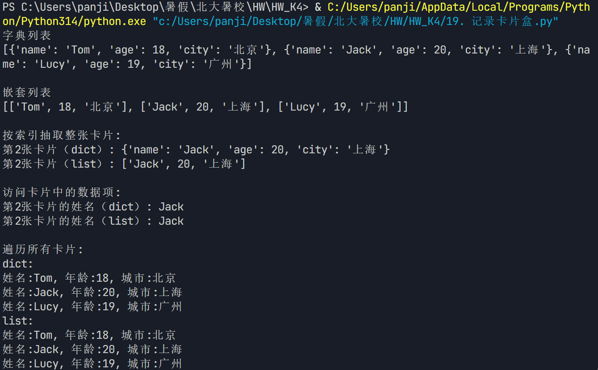

## 20. 添加兴趣

除了通过索引来访问字典条目中的列表元素，我们还可以通过append()等方法对列表进行添加元素等操作，如增加一个兴趣。
请编写程序试试吧！

```python
interest = ['篮球', '足球', '跑步']
print(f"初始兴趣列表: {interest}")
interest.append('钢琴')
print(f"添加兴趣后兴趣列表: {interest}")
```

(运行结果截图)
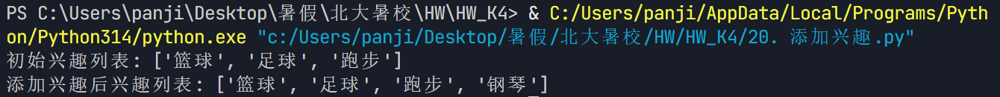

## 21. 条目关键字

试着用学号作为同学录字典的条目关键字，修改本节的示例，既可以采用整数类型来表示纯数字的学号，也可以采用字符串类型来表示。

```python
student_dict_int = {
    12: {"姓名": "刘桂花", "年龄": 18, "城市": "北京"},
    13: {"姓名": "孙柳", "年龄": 19, "城市": "重庆"},
    14: {"姓名": "康平", "年龄": 20, "城市": "广州"},
}

print("整数类型学号")
print(student_dict_int)
print(f"查询学号 13: {13 in student_dict_int}")

student_dict_str = {
    '12': {"姓名": "刘桂花", "年龄": 18, "城市": "北京"},
    '13': {"姓名": "孙柳", "年龄": 19, "城市": "重庆"},
    '14': {"姓名": "康平", "年龄": 20, "城市": "广州"},
}

print("\n字符串类型学号")
print(student_dict_str)
print(f"查询学号 '13': {'13' in student_dict_str}")

print("\n3: 访问学生信息")
print(f"整数版 student_dict_int[13] = {student_dict_int[13]['姓名']}")
print(f"字符串版 student_dict_str['13'] = {student_dict_str['13']['姓名']}")
```

(运行结果截图)
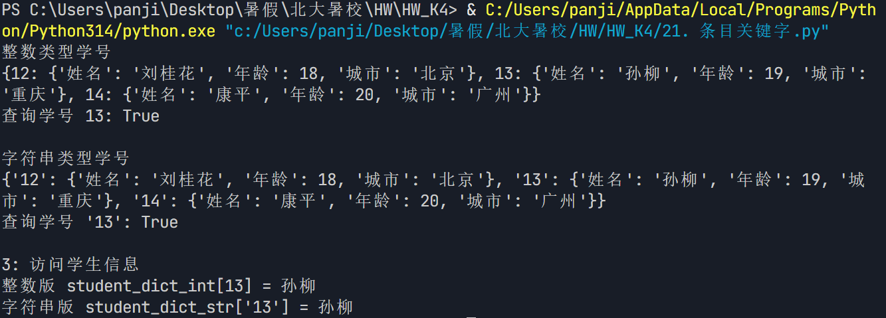

## 22. 类别的数量

在用Counter计数器进行分类统计后，如果想知道类别的数量，如生源城市的数量，可以用什么函数来得到？
请编写程序试试吧！

```python
from collections import Counter

cities = ['北京', '上海', '北京', '广州', '上海', '北京', '深圳', '广州', '杭州']

city_counter = Counter(cities)
print(f"生源城市统计: {city_counter}")

city_count = len(city_counter)
print(f"\n用 len() 得到类别数量: {city_count}")

print(f"\n结论: 用 len() 函数即可得到类别数量")
```

(运行结果截图)
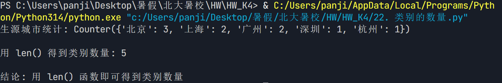