# 【K5】逻辑与控制思考题

## 1. 计算器的特点

“运算”、“存储”和“控制”是计算机内部的核心功能。
请对照日常生活中的普通计算器，看它是否符合“冯·诺依曼结构”计算机的特点。

（请写出你的答案）
**冯·诺依曼结构计算机的核心特点**是"**存储程序**"（stored-program）：程序（指令序列）和数据以同等地位存放在同一个存储器中，机器在工作时能**自动地、按顺序**从存储器中取出指令并执行，从而实现全自动处理。它由五大部件组成：**运算器、控制器、存储器、输入设备、输出设备**，其中"运算""存储""控制"是核心功能。

普通计算器**不符合**冯·诺依曼结构计算机的特点。

最关键的区别在于缺少"**存储程序**"这一核心思想。计算器虽然具备运算、少量存储和输入输出能力，但它的"程序"是由人脑实时控制的——每一步都依赖人手动按键，按键序列就是"程序"，却并未存储在机器内部由控制器自动取指执行。因此它是"人工实时驱动"的运算工具，而不是能自动执行程序的计算机。

## 2. 语句的次序

在本节示例的顺序结构程序中，哪些语句的次序可以调整？哪些语句的次序是不能调整的？
请在示例程序的代码中进行编辑修改，试试看吧。

```python
# 4-1-2-median.py
# 顺序结构程序
lst = [23, 45, 12, 35, 76, 10, 66, 75, 2]  # 把一组数放到列表中（奇数个）
lst.sort()  # 对列表进行从小到大的排序
n = len(lst)  # 得到数量
lmax = lst[-1]  # 最后一个数是最大值
lmin = lst[0]  # 第一个数是最小值
lmed = lst[n // 2]  # 中间的数是中位值
print(lst)  # 打印整个列表
print(f"max = {lmax}")  # 打印输出最大值
print(f"min = {lmin}")  # 打印输出最小值
print(f"median = {lmed}")  # 打印输出中位值
```

```python
lst2 = [23, 45, 12, 35, 76, 10, 66, 75, 2]  # 必须最先
n2 = len(lst2)             # 可与 sort 互换（只依赖 lst2）
lst2.sort()                # 必须在取最值 / 中位数之前
lmed2 = lst2[n2 // 2]      # 三者顺序可任意调换
lmin2 = lst2[0]
lmax2 = lst2[-1]
print(f"median = {lmed2}")  # 三个 print 顺序可任意调换
print(f"min = {lmin2}")
print(f"max = {lmax2}")
print(lst2)

print("""总结：
    【不可调】lst 创建 → sort →（lmax / lmin / lmed）→ 对应的 print，其中 n = len(lst) 必须在 lmed 之前（lmed 用到 n）

    【可调】  n 与 sort 之间、lmax / lmin / lmed 三者之间、三个 print 之间、print(lst) 的位置 —— 均互不依赖，可自由调整""")
```

(运行结果截图)
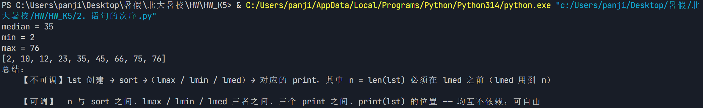

## 3. 嵌套的结构

我们知道，日常生活中的容器往往是可以嵌套的：箱子里装着若干盒子，盒子里还能装若干个口袋，里面才是各种物品。
结合图中的几种容器，说说嵌套结构中是什么结构包含了什么结构？

（请写出你的答案）
## 一、嵌套关系说明

程序的三种基本控制结构：**顺序结构、条件分支结构、循环结构**，它们之间可以互相嵌套。具体关系如下：

| 外层结构 | 可嵌套的内层结构 |
| :--- | :--- |
| **顺序结构** | 条件分支结构、循环结构、顺序结构 |
| **条件分支结构** | 顺序结构、循环结构、条件分支结构 |
| **循环结构** | 顺序结构、条件分支结构、循环结构 |

## 二、关系总结

1. **任何一种基本结构都可以作为"容器"**，包含任意一种或多种结构。
2. 这就像日常生活中的套娃：大容器（外层结构）可以装下小容器（内层结构），小容器里还可以装更小的容器，层层嵌套。
3. 例如：
    * **循环结构** 里可以嵌套 **条件分支结构**（如：遍历列表，对每个元素进行判断）。
    * **条件分支结构** 里可以嵌套 **循环结构**（如：如果满足条件，则执行一段循环代码）。
    * **循环结构** 里还可以嵌套 **循环结构**（如：打印九九乘法表）。

## 三、结论

嵌套结构中，**任意两种（或多种）基本控制结构之间都可以进行相互包含**。这是实现复杂逻辑的基础，也是结构化程序设计的核心思想。

## 4. 红绿灯规则的分支结构

请再提出另一种条件分支结构来归纳新版红绿灯通行规则。
注意考虑3个灯的颜色，以及当前车道这4个条件的组合，要覆盖通行规则规定的8种情形。

（请写出你的答案）
1. **右转拥有最高通行权**：只要右转灯不是红色，即可通行
2. **直行次之**：只要直行灯不是红色，即可通行
3. **左转最后**：只要左转灯不是红色，即可通行

#### 伪代码表示：
```
# 第一步：判断右转（最高优先级）
if 右转灯 != 红色:
    右转可以通行
else:
    右转必须停止

# 第二步：判断直行
if 直行灯 != 红色:
    直行可以通行
else:
    直行必须停止

# 第三步：判断左转（最低优先级）
if 左转灯 != 红色:
    左转可以通行
else:
    左转必须停止
```

## 5. 直行和右转的程序

请根据左转道通行规则的程序写法，将直行道和右转道的通行规则分别写成Python语言程序，并检验新版红绿灯通行规则的8种情形是否正确。

```python
left, middle, right = "N", "G", "R"

# 左转规则（原题原有）
if (left == "G") or (left == "N" and middle == "G"):
    left_state = "左转通行"
else:
    left_state = "左转停止"

# 直行规则
if (middle == "G") or (middle == "N" and (left == "G" or right == "G")):
    mid_state = "直行通行"
else:
    mid_state = "直行停止"

# 右转规则
if right == "G" or right == "N":
    right_state = "右转通行"
else:
    right_state = "右转停止"

# 输出结果
print(left_state)
print(mid_state)
print(right_state)
```

(运行结果截图)
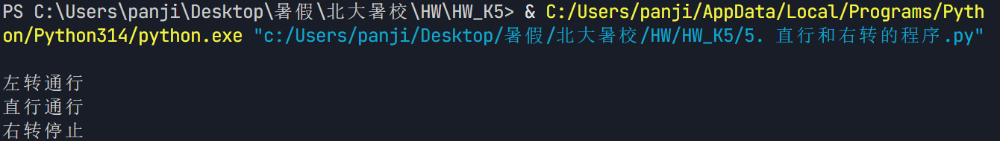

## 6. 年龄的分段条件

最后一个年龄段判别的程序虽然用了elif，但可能还不是最完美的，你可以把age改成负数-13，看看会输出什么。当然，年龄不可能是负数，但操作中肯定可能出现。
你能否修改程序，当有人无意把age赋值为负数的时候，给他一个友好的提示呢？
另外，可否进一步简化判断条件，让程序功能仍然保持不变呢？

```python
age = int(input("请输入年龄："))
while age < 0:
    print("年龄不能为负数，请重新输入！")
    age = int(input("请输入年龄："))

if age <= 6:
    print("童年")
elif age <= 17:
    print("少年")
elif age <= 40:
    print("青年")
elif age <= 65:
    print("中年")
else:
    print("老年")
```

(运行结果截图)
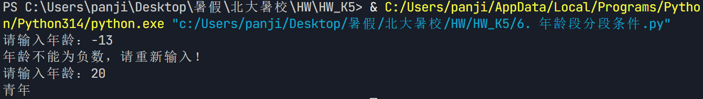

## 7. 循环结构的算法

如何把：

1. “向前走5个路口后，右转到达”，
2. “向前走，直到碰到丁字路口后向左转”

这两个行车路线指示写成循环结构的算法？

```python
print("向前走5个路口后，右转到达：")
for i in range(1, 6): 
    print(f"向前走，经过第{i}个路口")
print("已走完5个路口，右转")
print("到达目的地！")

import random

print("\n路线2：向前走，直到碰到丁字路口后向左转：")
i = 1      
while True:                     
    is_t_junction = random.choice([True, False])
    if is_t_junction:
        print(f"向前走，经过第{i}个路口，是丁字路口！")
        print("左转")
        print("到达目的地！")
        break
    else:
        print(f"向前走，经过第{i}个路口，不是丁字路口，继续向前")
        i += 1
```

(运行结果截图)
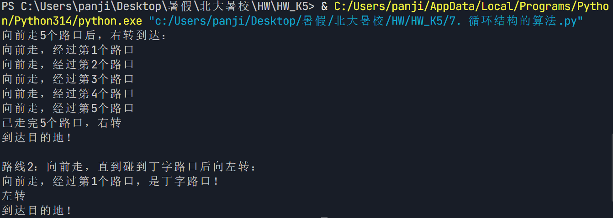

## 8. 被7整除

请写一个程序，计算出1,000以内所有能被7整除的数之和。

```python
total = 0
for i in range(1, 1001):
    if i % 7 == 0:
        total += i
print(total)
```

(运行结果截图)
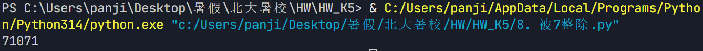

## 9. 阶乘的意外

从1连续累乘到n，称为n的阶乘，记为n!，

- 例如，5的阶乘5!=1×2×3×4×5=120。

阶乘是一个非常出人意料的运算，它能够迅速得到很大的整数。
请用条件循环while语句编写一段程序，看看多少的阶乘刚好超过1亿？

```python
n = 1
fact = 1

while fact <= 100000000:
    n += 1
    fact *= n

print(f"{n} 的阶乘 {n}! = {fact}，刚好超过1亿")
```

(运行结果截图)
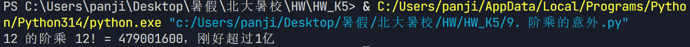

## 10. 不用continue语句

请修改“跳过7”的示例程序，不用continue语句，但实现同样的功能。

```python
tips = []
for i in range(1, 100):
    if ("7" not in str(i)) and (i % 7 != 0):
        tips.append(i)
    else:
        tips.append("过!")

print(tips)
```

(运行结果截图)
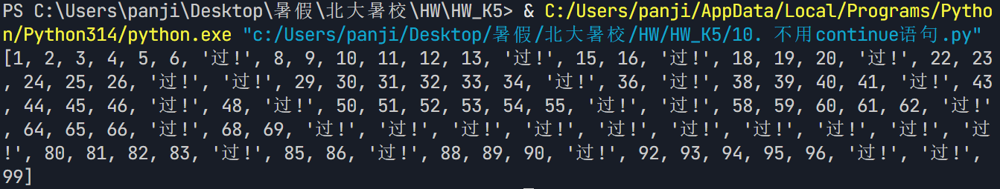

## 11. 条件分支与循环结构练习（OJ）

### 11.1 打印正方形

```python
n = int(input())
if 1<=n<=40:
    for i in range(1,n+1):
        for j in range(1,n+1):
            print("*",end="")
        print()
else:
    print("输入有误：n必须在1到40之间")
```

(运行结果截图)
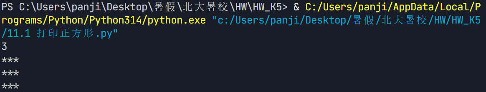

### 11.2 打印三角形

```python
n = int(input())
if 1<=n<=40:
    for i in range(1,n+1):
        for j in range(1,i+1):
            print("*",end="")
        print()
else:
    print("输入有误：n必须在1到40之间")
```

(运行结果截图)
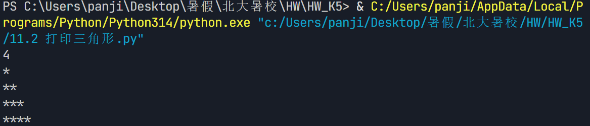

### 11.3 计算阶乘

```python
n = int(input())
fact = 1
if 1<=n<=20:
    for i in range(1,n+1):
        fact *= i
    print(fact)
else:
    print("输入有误：n必须在1到20之间")\
```

(运行结果截图)
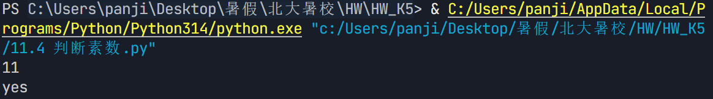

### 11.4 判断素数

```python
n = int(input())
if n <= 1:
    print("no")
else:
    for i in range(2, int(n**0.5) + 1):
        if n % i == 0:
            print("no")
            break
    else:
        print("yes")
```

(运行结果截图)


### 11.5 求素数个数

```python
a = int(input())
b = int(input())
prime_count = 0
for i in range(a, b+1):
    if i <= 1:
        continue
    for j in range(2, int(i**0.5) + 1):
        if i % j == 0:
            break
    else:
        prime_count += 1
print(prime_count)
```

(运行结果截图)
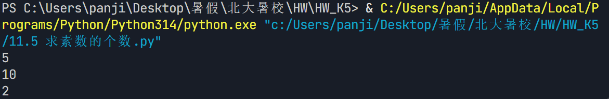

### 11.6 判断1的个数

```python
n = int(input())
count = 0
for i in range(1, n + 1):
    count += str(i).count("1")
print(count)
```

(运行结果截图)
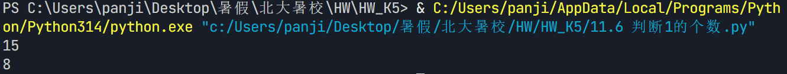

### 11.7 跳过数字7

```python
n = int(input())
total = 0
for i in range(1, n + 1):
    if i % 7 != 0 and '7' not in str(i):
        total += i
print(total)
```

(运行结果截图)
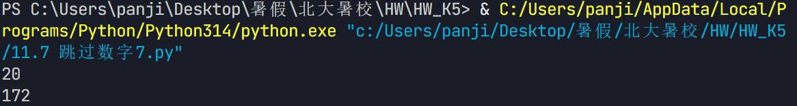

## 12. 累乘的进度条

请复习迭代循环章节中计算累乘的程序，给程序加上tqdm进度条。
提示：由于计算时间极短，可以在计算累乘的循环中加上模拟耗时的sleep()函数，以便观察进度条的变化。

```python
import time
from tqdm import tqdm

n = 20              # 累乘到 20
product = 1         # 累乘结果，初始为 1

# 用 tqdm 包装可迭代对象，即可在循环时显示进度条
for i in tqdm(range(1, n + 1), desc="累乘进度"):
    product *= i
    time.sleep(0.2)   # 模拟耗时，方便观察进度条变化

print(f"\n{n}! = {product}")
```

(运行结果截图)
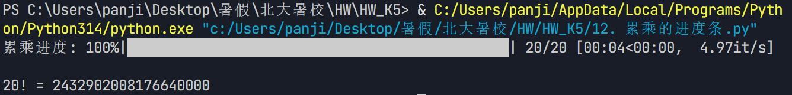

## 13. 圆周率计算

请修改本节的程序，实现每1000个点才更新一次进度条描述信息，并把随机点总数增加到1000万个，看看效果如何，并观察随着随机点总数的增加，计算结果是否会更加精确。

提示：可以通过判断循环变量i是否能被1 000整除来实现每1000个点更新一次，用set_description()。

```python
from random import random
from tqdm import tqdm

N = 10_000_000  # 1000万个随机点，下划线是数字分隔符，不影响数值
c = 0

pbar = tqdm(range(1, N + 1))
for i in pbar:
    x, y = random(), random()
    # 直接比较平方，省去开根号，等价于距离<1
    if x * x + y * y < 1:
        c += 1
    
    # 每1000个点计算一次pi并更新描述
    if i % 1000 == 0:
        pi = (c / i) * 4.0
        pbar.set_description(f"pi: {pi:.8f}")

# 输出最终结果
final_pi = c / N * 4.0
print(f"最终计算的圆周率 pi = {final_pi:.8f}")
```

(运行结果截图)
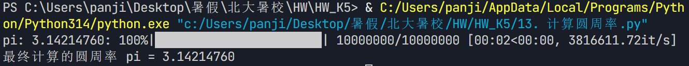

## 14. 异常处理

如果编写一个计算器程序，请用户输入两个浮点数，程序计算两数相除的结果并输出，
这个程序可能会涉及哪些异常处理？

（请写出你的答案）
### 1. ValueError（值错误）

**触发条件**：
- 用户输入的不是数字（如 `abc`、`#`、`hello`）
- 用户直接按回车键（空字符串 `""`）
- 用户输入格式错误的数字（如 `1.2.3`、`1,000`）

**处理方法**：
- 捕获异常后提示用户"请输入有效的数字"
- 可以循环要求用户重新输入，直到输入合法为止

---

### 2. ZeroDivisionError（除零错误）

**触发条件**：
- 用户输入的第二个数（除数）为 `0`

**处理方法**：
- 捕获异常后提示用户"除数不能为0，请重新输入"
- 可以循环要求用户重新输入除数，直到输入非零值为止

## 15. 计算器程序

请编写程序，实现上一节思考题所提到的计算器程序。

```python
try:
    a = float(input("请输入第一个数："))
    b = float(input("请输入第二个数："))
    print(a / b)
except ZeroDivisionError:
    print("除数不能为0")
except ValueError:
    print("请输入数字")
```

(运行结果截图)
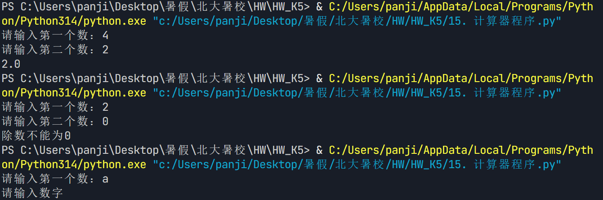

## 16. 强壮的程序

请复习前面多种情况的条件分支中判断年龄段的程序，将其修改为由用户输入年龄，写一个“强壮”的程序。

```python
def get_valid_age():
    while True:
        try:
            age_str = input("请输入您的年龄：")
            
            # 处理空输入
            if age_str.strip() == "":
                print("输入不能为空，请重新输入！")
                continue
            
            # 尝试转换为整数
            age = int(age_str)
            
            # 检查年龄范围是否合理（0~150岁）
            if age < 0:
                print("年龄不能为负数，请重新输入！")
            elif age > 150:
                print(f"年龄 {age} 岁不太合理，请重新输入！")
            else:
                return age
                
        except ValueError:
            print("输入格式错误，请输入一个整数！")

def judge_age_stage(age):
    """根据年龄判断所处的年龄段"""
    if age <= 6:
        return "童年"
    elif age <= 17:
        return "少年"
    elif age <= 40:
        return "青年"
    elif age <= 65:
        return "中年"
    else:
        return "老年"

age = get_valid_age()

stage = judge_age_stage(age)

print(f"\n您输入的年龄是：{age} 岁")
print(f"对应的年龄段为：{stage}")
```

(运行结果截图)
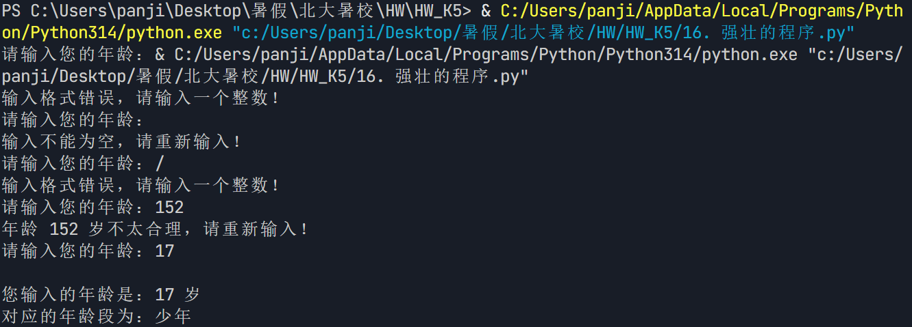