# 【K6】文件和函数

## 1. 了解文件系统和文件

请确认所使用的计算机操作系统，看看硬盘的属性，确认文件系统是哪一个
并查看某个文件的属性，了解其文件名、所处目录的位置、大小、创建时间、修改时间等。

（请写出你的答案）
* 我使用的计算机操作系统是Windows11
* 我使用的硬盘文件系统是NTFS
* 我使用的文件是skip7tips.dat
* 我使用的文件所在目录是C:\Users\panji\Desktop\北大暑校\HW\HW_K6
* 我使用的文件大小是1024字节
* 我使用的文件创建时间是2026-07-31 10:00:00
* 我使用的文件修改时间是2026-07-31 10:00:00

## 2. 写入和读出小抄

请找到“逻辑与控制”一章中的“跳过7游戏”程序，给它增加把游戏小抄写入数据文件skip7tips.dat的环节。
另外写一段程序，从小抄数据文件读取并打印出小抄内容。

```python
n = int(input("请输入一个正整数n："))
total = 0
tips = []
for i in range(1, n + 1):
    if i % 7 != 0 and '7' not in str(i):
        total += i
    else:
        tips.append(i)

# 把游戏小抄写入数据文件 skip7tips.dat
with open('skip7tips.dat', 'w', encoding='utf-8') as f:
    for num in tips:
        f.write(str(num) + '\n')

print("1~{}中未被跳过数字的累加和为：{}".format(n, total))
print("已将 {} 个需要跳过的数字写入 skip7tips.dat".format(len(tips)))


# 读取并打印小抄内容
with open('skip7tips.dat', 'r', encoding='utf-8') as f:
    tip_list = f.read().split()
print(" ".join(tip_list))
```

(运行结果截图)
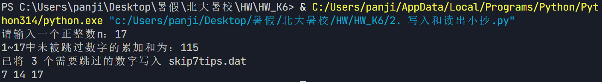

## 3. 分段复制文件

在拷贝文件的例子中，如果源文件很大，可能无法全部读入到内存的字节序列对象里，那么我们有什么办法来复制大文件吗？
提示：调用f.seek(0, 2)表示将当前指针设置到文件尾部，其返回值就是文件的字节数。

```python
import os

src_file = 'SourceHanSansSC-Normal.otf'
dst_file = 'copy_of_font.otf'

# 以二进制模式打开源文件
with open(src_file, 'rb') as f_src:
    total_size = f_src.seek(0, 2)
    print("源文件大小：{} 字节（约 {:.2f} MB）".format(total_size, total_size / 1024 / 1024))

    f_src.seek(0)

    # 分段复制：每次读取 chunk_size 字节，写入目标文件
    chunk_size = 1024 
    copied = 0
    with open(dst_file, 'wb') as f_dst:
        while copied < total_size:
            chunk = f_src.read(chunk_size) 
            f_dst.write(chunk)               
            copied += len(chunk)
    print("已复制 {} 字节，复制完成！".format(copied))

print("源文件大小：", os.path.getsize(src_file))
print("目标文件大小：", os.path.getsize(dst_file))
```

(运行结果截图)
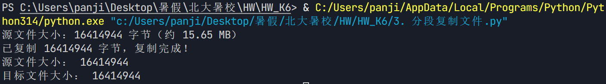

## 4. gb2312编码的限制

gb2312是一个比较小的中文字符集，包含汉字的数量少，有一些生僻字就不会被收录和编码，如果用gb2312对Python语言中的字符串进行编码，字符串包含生僻字的话，编码就可能出错。
请找到生僻字“仌”（读音和本义同“冰”），尝试用gb2312编码，看看结果如何。

```python
char = '仌'
print("生僻字：{}（读音和本义同'冰'）".format(char))

# 尝试用 gb2312 编码
try:
    encoded = char.encode('gb2312')
    print("gb2312 编码成功：", encoded)
except UnicodeEncodeError as e:
    print("gb2312 编码失败：", e)
```

(运行结果截图)
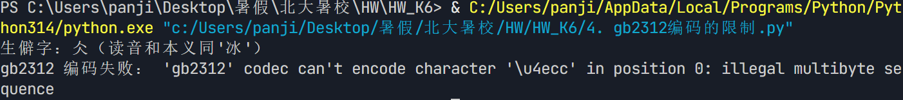

## 5. 文件添加模式

如果用at模式打开文本文件，可以用writelines()方法向文本文件末尾添加文本。
请编写程序，向lyric2.txt添加《黄鹤楼》的后4句：“晴川历历汉阳树，芳草萋萋鹦鹉洲。日暮乡关何处是？烟波江上使人愁。”每句一行。

```python
with open('lyric2.txt', 'w', encoding='utf-8') as f:
    f.write('昔人已乘黄鹤去，此地空余黄鹤楼。\n')
    f.write('黄鹤一去不复返，白云千载空悠悠。\n')

lines = [
    '晴川历历汉阳树，\n',
    '芳草萋萋鹦鹉洲。\n',
    '日暮乡关何处是？\n',
    '烟波江上使人愁。\n',
]
with open('lyric2.txt', 'at', encoding='utf-8') as f:
    f.writelines(lines)

with open('lyric2.txt', 'r', encoding='utf-8') as f:
    print(f.read())
```

(运行结果截图)
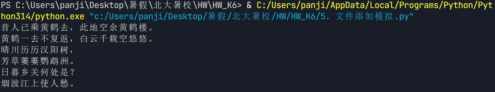

## 6. 歌词记录本

请输入歌词记录本示例程序，调试运行成功，并试着加入一些新功能。
（例如：删除一行，更新一行等功能）

```python
fname = input("请输入歌词文件名: ")
try:
    f = open(fname, "xt", encoding='utf-8')
except FileExistsError:
    f = open(fname, "rt", encoding='utf-8')
    lyric = f.read()
    print(lyric)
    f.close()
    print("歌词文件已经存在，可继续添加歌词！")
    f = open(fname, "at", encoding='utf-8')

# 输入歌词，以空行结束
print("下面请继续输入歌词，每行回车，直接回车结束输入")
line = input("歌词: ")
while line != "":
    f.write(line + "\n")
    line = input("歌词: ")
f.close()
print("歌词已经记录到文件中，再见！")

#新新增功能：查看、删除、更新一行歌词
print("\n歌词管理新功能")
print("当前歌词内容：")
with open(fname, 'rt', encoding='utf-8') as f:
    lines = f.readlines()  # 读成列表，每行带换行符
for i, l in enumerate(lines, 1):
    print("  [{}] {}".format(i, l.rstrip('\n')))

# 提供操作菜单
while True:
    print("\n请选择操作：")
    print("  1. 查看歌词")
    print("  2. 删除一行")
    print("  3. 更新一行")
    print("  4. 退出")
    choice = input("请输入选项 (1/2/3/4): ").strip()
    if choice:                      # 输入非空时，只取第一个字符来匹配
        choice = choice[0]          # 这样输入 "4"、"4."、"4. 退出" 都能识别为 "4"

    if choice == '1':
        print("\n当前歌词：")
        for i, l in enumerate(lines, 1):
            print("  [{}] {}".format(i, l.rstrip('\n')))

    elif choice == '2':
        try:
            idx = int(input("请输入要删除的行号: "))
            if 1 <= idx <= len(lines):
                removed = lines.pop(idx - 1)
                print("已删除第{}行：{}".format(idx, removed.rstrip('\n')))
                # 同步写回文件
                with open(fname, 'wt', encoding='utf-8') as f:
                    f.writelines(lines)
            else:
                print("行号超出范围！")
        except ValueError:
            print("请输入有效数字！")

    elif choice == '3':
        try:
            idx = int(input("请输入要更新的行号: "))
            if 1 <= idx <= len(lines):
                new_line = input("请输入新的歌词内容: ")
                lines[idx - 1] = new_line + '\n'
                print("已更新第{}行".format(idx))
                with open(fname, 'wt', encoding='utf-8') as f:
                    f.writelines(lines)
            else:
                print("行号超出范围！")
        except ValueError:
            print("请输入有效数字！")

    elif choice == '4':
        print("退出管理，再见！")
        break
    else:
        print("无效选项，请重试。")
```

(运行结果截图)
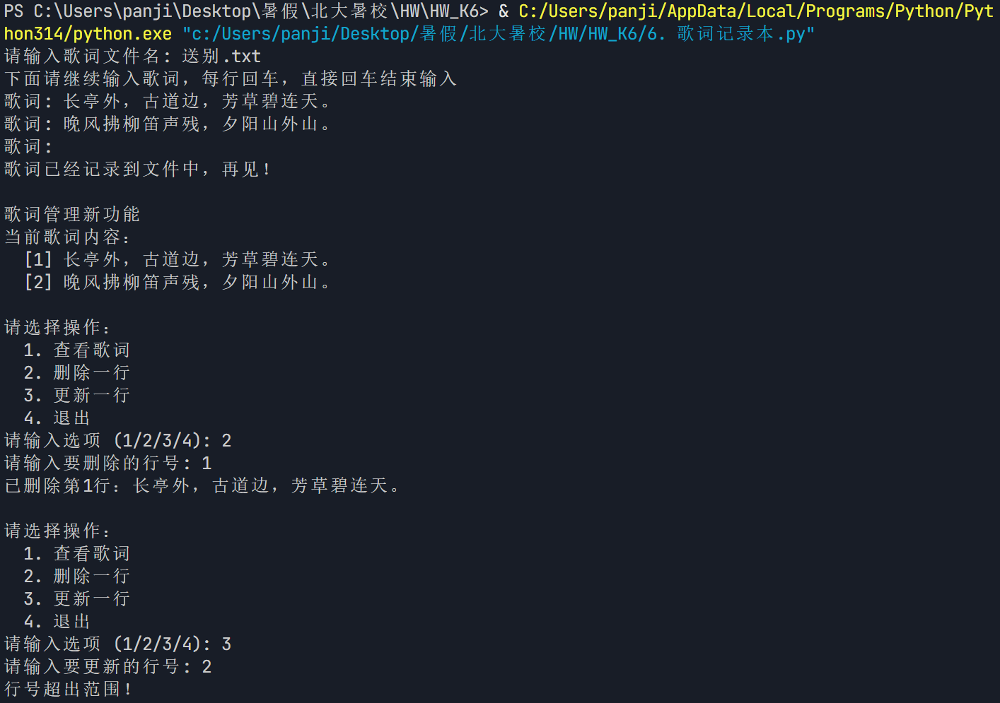
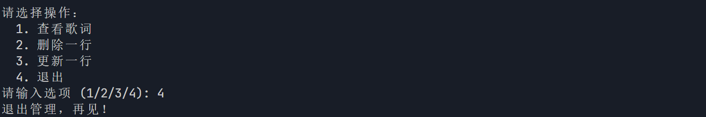

## 7. 分词的二义性

中文分词是个很复杂的问题，因为分词不同，会引起整个句子的意义混淆甚至完全相反。
请体会“销售部长会开到了半夜”和“下雨天留客天留人不留”这两句话的不同分词效果。

（请写出你的答案）
* 句子一：销售部长会开到了半夜
分词方式一：销售部长 / 会 / 开到了 / 半夜
   含义：销售部长主持会议，开到了半夜
分词方式二：销售 / 部长会 / 开到了 / 半夜
   含义：销售部门的部长会议，开到了半夜
* 句子二：下雨天留客天留人不留
分词方式一：下雨天 / 留客 / 天留 / 人 / 不留
   含义：下雨天留客，天要留人，人却不留（人意要走）
分词方式二：下雨天 / 留客天 / 留人不？/ 留
   含义：下雨天正是留客的天，留人吗？留！（主人挽留客人）
分词方式三：下雨 / 天留客 / 天留 / 人 / 不留
   含义：下雨，天留客，天要留，人偏不留（人意要走）

## 8. 调整分词

请用jieba模块对“销售部长会开到了半夜”这句话进行分词，看看是否符合期望，并通过添加和删除词汇，将这句话的分词调整为另一种方式。

```python
import jieba

sentence = "销售部长会开到了半夜"

print("1. 默认分词结果")
words = jieba.lcut(sentence)
print("  ".join(words))
print("  （不符合期望：'会开'黏在一起，'销售部长'被拆散）")

jieba.add_word("销售部长")
jieba.add_word("开到了")

print("\n2. 调整为方式一：销售部长 / 会 / 开到了 / 半夜")
words1 = jieba.lcut(sentence)
print("  ".join(words1))

jieba.del_word("销售部长")
jieba.add_word("部长会")

print("\n3. 调整为方式二：销售 / 部长会 / 开到了 / 半夜")
words2 = jieba.lcut(sentence)
print("  ".join(words2))
```

(运行结果截图)
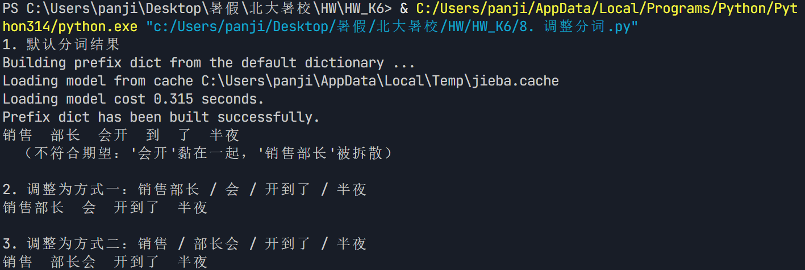

## 9. 前20高频词

一个人写作的常用词往往相对固定，而且有较为明显的特征。
请找到一些现当代文学小说的文本，对比不同作者，看其使用的高频词有什么不同。

```python
import re
import jieba
from collections import Counter

# 1. 读取并按作者分组解析全唐诗
authors = {}
current_author = ""

with open('全唐诗.txt', 'r', encoding='utf-8') as f:
    for line in f:
        line = line.strip()

        m = re.match(r'卷\d+_\d+\s*【.*?】(\S+)', line)
        if m:
            current_author = m.group(1)
            authors.setdefault(current_author, "")
        elif line and current_author:
            authors[current_author] += line

print("全唐诗共收录 {} 位诗人的作品\n".format(len(authors)))

# 2. 选择4位著名诗人对比
poets = ["李白", "杜甫", "白居易", "王维"]

# 停用词：文言虚词及无意义高频单字
stopwords = set("之乎者也矣焉哉兮尔其于此乃则以而为若何所不无一有人"
                "山水风云月日花草春秋冬夏上下中前后外来去归知情见"
                "不得是已还亦皆即只因如欲能行坐立看闻道言心身名客游"
                "青白红尘明暗远高长短新旧死生老少轻重")
# 标点符号
puncts = set("，。、；：？！""''（）·…—《》【】\n\r\t ")

def top20(text):
    """对文本分词，返回前20高频词（过滤单字、标点、停用词）"""
    words = jieba.lcut(text)
    valid = [w for w in words
             if len(w) >= 2
             and re.search(r'[\u4e00-\u9fff]', w)
             and not all(c in stopwords for c in w)] 
    return Counter(valid).most_common(20)

# 3. 输出每位诗人的前20高频词
for poet in poets:
    if poet in authors:
        print("=" * 45)
        print("{} 的高频词（诗作 {} 字）".format(poet, len(authors[poet])))
        print("=" * 45)
        for i, (word, cnt) in enumerate(top20(authors[poet]), 1):
            print("  {:2d}. {:<6s}  {}次".format(i, word, cnt))
        print()
    else:
        print("未找到诗人 {} 的作品\n".format(poet))
```

(运行结果截图)
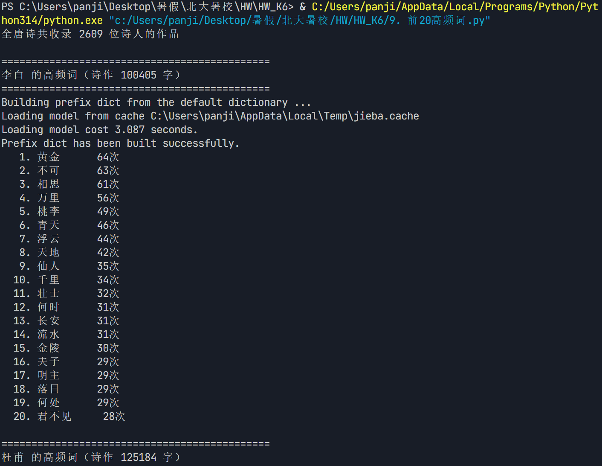
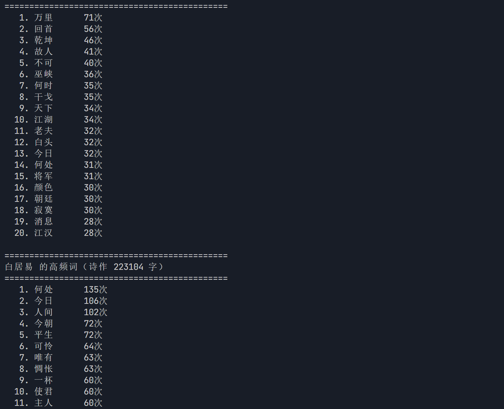
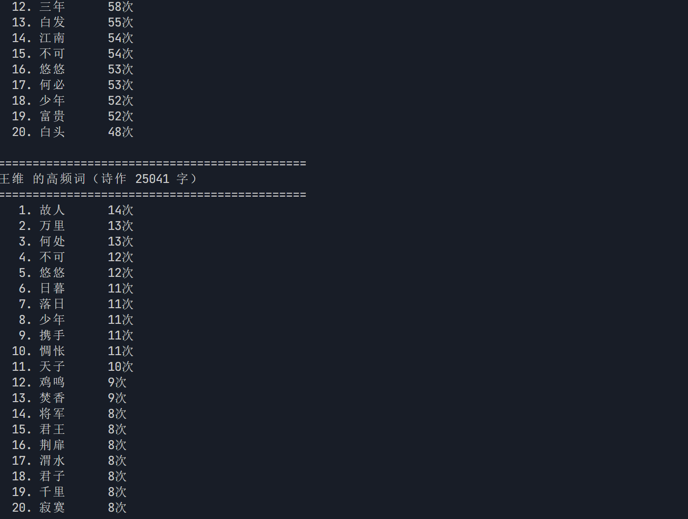

## 10. 盘货记录

由于CSV格式文件首先是文本文件，所以用文本文件的读写函数也能处理CSV格式文件。
请编辑一个“盘货记录.csv”文件，用**文本文件**读写方式来处理看看。

```python
with open("盘货记录.csv", "w", encoding="utf-8") as f:

    f.write("商品编号,商品名称,库存数量,单价(元)\n")

    f.write("SP001,笔记本,128,5.5\n")
    f.write("SP002,中性笔,350,2.0\n")
    f.write("SP003,文件夹,76,8.8\n")
    f.write("SP004,订书机,22,15.0\n")

print("盘货记录.csv 文件已创建并写入完成")
```

(运行结果截图)
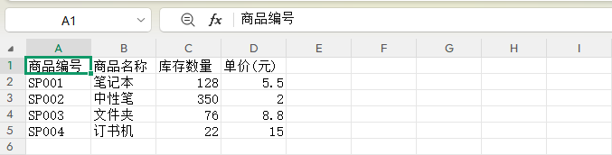

## 11. 增加记录项

请修改本节的示例程序，给盘货记录加一项“价格”，即每一行数据有“品名”“数量”和“价格”3项。

```python
import csv

colnames = ["品名", "数量", "价格"]
item = {}

f = open("盘货记录_带价格.csv", "w", encoding="utf-8")
writer = csv.DictWriter(f, fieldnames=colnames)
writer.writeheader()

skewer = input("请输入品名：（直接回车退出程序）")
while skewer != "":
    count = input("请输入数量：")
    price = input("请输入单价：")

    item = {"品名": skewer, "数量": count, "价格": price}
    writer.writerow(item)
    print(f"----成功写入{item}")
    skewer = input("请输入品名：（直接回车退出程序）")

print("再见！")
f.close()
```

(运行结果截图)
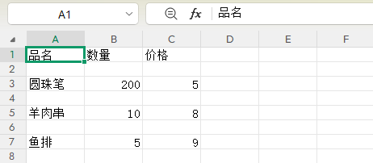

## 12. 电子表格文件

CSV格式文件也可以被Excel或者WPS Office电子表格打开。
请尝试打开地震数据文件，观察里面的标题和数据，再将其另存为XLS电子表格文件。
提示：可以熟悉一下电子表格的格式排版等操作

(操作结果截图)
XLS：
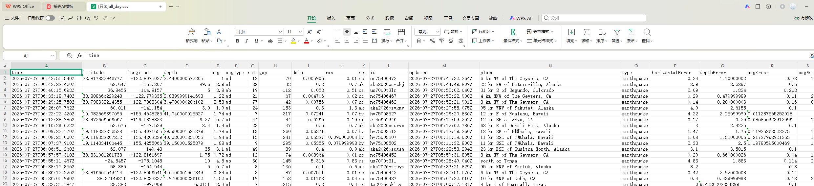
Excel：
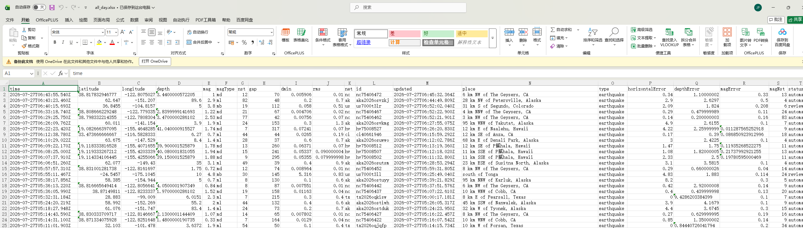

## 13. JSON格式

如果给示例中的JSON格式歌曲信息加一个“歌词”条目，而且每一行歌词是一个字符串，应该怎么写JSON条目？

```json
import json

song = {
    "标题": "春芽",
    "演唱者": "Wang",
    "作者": {
        "作词": "Pei",
        "作曲": "Pei",
        "编曲": "Pei"
    },
    "专辑": {
        "名称": "四季",
        "歌曲数量": 4,
        "歌曲列表": ["春芽", "热夏", "秋酿", "知寒"]
    },

    "歌词": [
        "春日里的嫩芽，悄悄破土而出",
        "带着希望与梦想，沐浴着阳光",
        "微风轻拂，万物苏醒",
        "这是新的开始，春的礼物"
    ]
}

print("=== JSON 格式（带缩进）===")
json_str = json.dumps(song, ensure_ascii=False, indent=2)
print(json_str)


with open('13. JSON格式.json', 'w', encoding='utf-8') as f:
    json.dump(song, f, ensure_ascii=False, indent=2)
print("\n已写入 13. JSON格式.json")


with open('13. JSON格式.json', 'r', encoding='utf-8') as f:
    loaded = json.load(f)
print("\n=== 从文件读回验证 ===")
print("标题:", loaded['标题'])
print("歌词共", len(loaded['歌词']), "行：")
for i, line in enumerate(loaded['歌词'], 1):
    print(f"  {i}. {line}")
```

## 14. 增加歌词条目

请修改本节的示例程序，增加“歌词”条目，并运行成功。

```python
import json

song_info = {
    "标题": "春芽",
    "演唱者": "Wang",
    "作者": {"作词": "Pei", "作曲": "Pei", "编曲": "Pei"},
    "专辑": {"名称": "四季", "歌曲数量": 4, "歌曲列表": ["春芽", "热夏", "秋酿", "知寒"]},
    "歌词": "春风吹绿枝桠，新芽慢慢长大，走过四季变化，歌声伴着年华"
}

print(f"歌曲信息对象的类型: {type(song_info)}")

song_json = json.dumps(song_info, ensure_ascii=False)
print(song_json)
```

(运行结果截图)
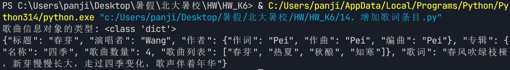

## 15. 删除时间标记

示例代码中获取到的歌词带有时间标记。
请修改程序，将歌词中的时间标记删除后再输出。

```python
import urllib.request
import json
import re

# 歌词抓取API链接
lyric_url = "http://music.163.com/api/song/media"

song = input("请输入歌曲链接或ID: ")
# 从歌曲链接分离id字符串
id = song.split("=")[-1]

# 从网站请求歌词
f = urllib.request.urlopen(f"{lyric_url}?id={id}")
lyric_bytes = f.read()
f.close()

# 解析歌词
lyric_json = lyric_bytes.decode()
lyric = json.loads(lyric_json)

print(f"返回数据的关键字: {lyric.keys()}")


raw_lyric = lyric["lyric"]

clean_lyric = re.sub(r'\[\d{2}:\d{2}\.\d{2,3}\]', '', raw_lyric)

clean_lyric = '\n'.join([line.strip() for line in clean_lyric.splitlines() if line.strip()])

print("\n纯净歌词：")
print(clean_lyric)
```

(运行结果截图)
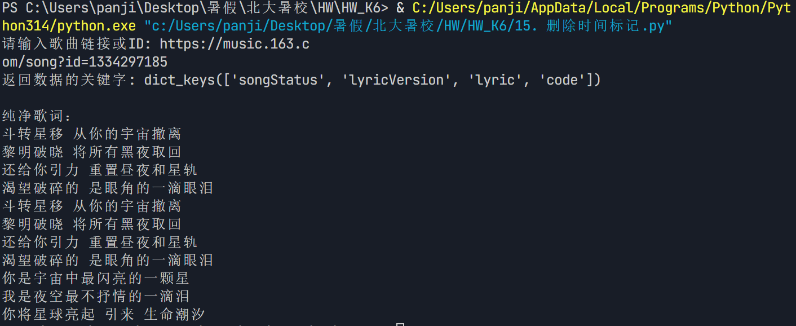

## 16. 重新整合代码

可以回顾一下本书前面章节的示例程序，看看有哪些较长的代码可以重新整合？
例如：全唐诗词频分析

```python
import re
import jieba
from collections import Counter

STOPWORDS = set("之乎者也矣焉哉兮尔其于此乃则以而为若何所不无一有人"
                "山水风云月日花草春秋冬夏上下中前后外来去归知情见"
                "不得是已还亦皆即只因如欲能行坐立看闻道言心身名客游"
                "青白红尘明暗远高长短新旧死生老少轻重")


#函数1：按作者解析全唐诗文件
def parse_poems_by_author(filename):
    """读取全唐诗文件，返回 {作者: 该作者全部诗作拼接文本}"""
    authors = {}
    current_author = ""
    with open(filename, 'r', encoding='utf-8') as f:
        for line in f:
            line = line.strip()
            m = re.match(r'卷\d+_\d+\s*【.*?】(\S+)', line)
            if m:
                current_author = m.group(1)
                authors.setdefault(current_author, "")
            elif line and current_author:
                authors[current_author] += line
    return authors


#函数2：统计某文本的前N高频词
def top_n_words(text, n=20):
    """对文本分词，返回前N高频词（过滤单字、标点、停用词）"""
    words = jieba.lcut(text)
    valid = [w for w in words
             if len(w) >= 2
             and re.search(r'[\u4e00-\u9fff]', w)
             and not all(c in STOPWORDS for c in w)]
    return Counter(valid).most_common(n)


#函数3：打印某诗人的高频词报告
def print_report(poet, text, n=20):
    """打印某位诗人的前N高频词报告"""
    print("=" * 45)
    print("{} 的高频词（诗作 {} 字）".format(poet, len(text)))
    print("=" * 45)
    for i, (word, cnt) in enumerate(top_n_words(text, n), 1):
        print("  {:2d}. {:<6s}  {}次".format(i, word, cnt))
    print()


#函数4：对比多位诗人的高频词
def compare_poets(authors, poets, n=20):
    """对比多位诗人的高频词"""
    for poet in poets:
        if poet in authors:
            print_report(poet, authors[poet], n)
        else:
            print("未找到诗人 {} 的作品\n".format(poet))


#函数5：找出某诗人独有的特色词
def unique_words(authors, poet, n=10):
    """找出某诗人高频词中、其他指定对比诗人都没用的特色词"""
    poets_to_compare = ["李白", "杜甫", "白居易", "王维"]
    poets_to_compare = [p for p in poets_to_compare if p != poet and p in authors]

    my_words = {w for w, _ in top_n_words(authors[poet], 30)}
    others_words = set()
    for p in poets_to_compare:
        others_words |= {w for w, _ in top_n_words(authors[p], 30)}

    unique = my_words - others_words
    print("{} 的特色词（其他对比诗人没用）：{}".format(poet, "、".join(sorted(unique)) or "无"))
    print()


#主程序：调用各函数完成分析
def main():
    # 1. 解析全唐诗
    authors = parse_poems_by_author('全唐诗.txt')
    print("全唐诗共收录 {} 位诗人的作品\n".format(len(authors)))

    # 2. 对比四位诗人
    poets = ["李白", "杜甫", "白居易", "王维"]
    compare_poets(authors, poets, n=20)

    # 3. 找出每位诗人的特色词
    print("=" * 45)
    print("各诗人特色词对比")
    print("=" * 45)
    for poet in poets:
        unique_words(authors, poet)


if __name__ == "__main__":
    main()
```

## 17. def的次序

试着把调用函数的语句放到def语句之前，看看会触发什么错误？
对比变量需要先赋值才能被表达式引用，说说def语句的作用。

```python
# 先调用函数
ChangSha()

# 后定义函数
def ChangSha():
    print("杭州-长沙：MF8229航班")
    print("Day1-到橘子洲风景区游玩")
```
* def语句的作用：
1. 创建函数对象：将缩进块内的代码打包封装成一个可复用的函数对象，包含函数的逻辑、参数、返回值等信息。
2. 绑定函数名：将创建好的函数对象赋值给def后面的函数名（相当于给函数类型的变量赋值），执行完def语句后，这个名字才会在程序中生效，可以被调用。
3. 实现代码复用与模块化：把一段完成特定功能的代码封装成函数后，可以在程序任意位置反复调用，避免重复写代码，同时让程序结构更清晰，拆分不同功能模块。

(运行结果截图)
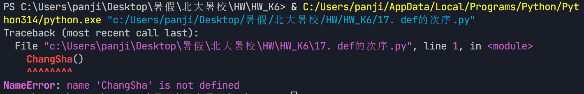

## 18. 出错的位置

如果在def ChongQing()函数的语句块中加一条print(1//0)的错误语句，再运行程序，看看“除以0的”的错误会发生在什么时候？
思考执行def语句时是否执行了函数语句块。

```python
def ChangSha():
    print("杭州-长沙：MF8229航班")
    print("Day1-到橘子洲风景区游玩")
    print("Day1-到长沙天心区坡子街享受美食")

def ChengDu():
    print("长沙-成都：CA4392航班")
    print("Day1-到宽窄巷子游玩")
    print("Day1-到春熙路游玩美食")
    print("Day2-到国际非遗博览园看音乐节")
    print("Day2-到太古里游玩美食")

def ChongQing():
    print("成都-重庆：G8685高铁")
    print("Day1-到解放碑游玩")
    print(1 // 0)  # 新增的除零错误语句
    print("Day1-到八一路好吃街美食")
    print("Day2-到磁器口古镇游玩")
    print("Day2-到朝天门广场美食")
    print("重庆-杭州：CA1706航班")

# 主程序依次调用
ChangSha()
ChengDu()
ChongQing()
```

(运行结果截图)
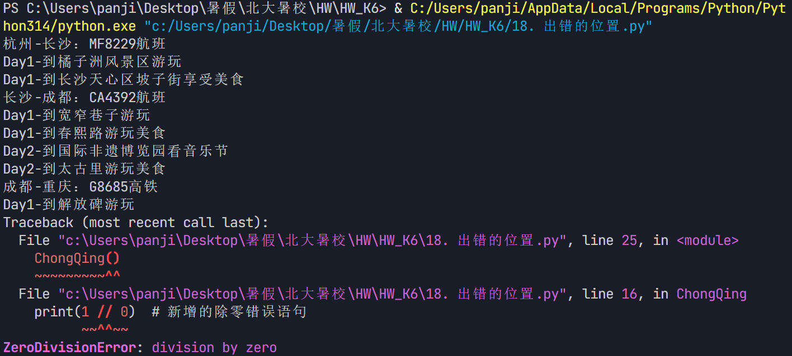

## 19. 奇偶数函数

请写一个具有一个选项参数的函数parity()，用于判断一个整数的奇偶性，相应地打印“奇数”或者“偶数”。


```python
def parity(n, style="中文"):
    """
    判断整数 n 的奇偶性并打印结果
    选项参数 style：控制输出形式
        "中文" -> 打印"奇数"或"偶数"（默认）
        "英文" -> 打印"odd"或"even"
        "数学" -> 打印 n ≡ 1 (mod 2) 或 n ≡ 0 (mod 2)
    """
    if n % 2 == 0:
        if style == "中文":
            print("偶数")
        elif style == "英文":
            print("even")
        elif style == "数学":
            print("{} ≡ 0 (mod 2)".format(n))
    else:
        if style == "中文":
            print("奇数")
        elif style == "英文":
            print("odd")
        elif style == "数学":
            print("{} ≡ 1 (mod 2)".format(n))

print("=== 默认选项（中文）===")
parity(7)
parity(10)

print("\n=== 英文选项 ===")
parity(7, style="英文")
parity(10, style="英文")

print("\n=== 数学选项 ===")
parity(7, style="数学")
parity(10, style="数学")

print("\n=== 交互测试 ===")
num = int(input("请输入一个整数: "))
parity(num)
```

(运行结果截图)
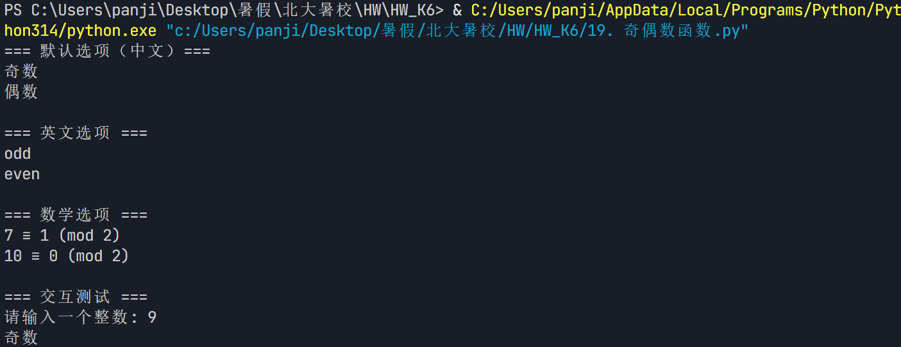

## 20. 实在参数

实在参数是赋值给形式参数的值，所以它既可以是字面值，也可以是表达式，还可以是变量。
请修改checkin()函数的调用代码，试试各种不同形式的实在参数。

```python
def checkin(name, room):
    """登记入住信息"""
    print("  {} 入住 {} 房间".format(name, room))

print("1. 字面值作为实参")
checkin("张三", 101)
checkin("李四", 202)

print("\n2. 表达式作为实参")
checkin("王" + "五", 100 + 3)
checkin("赵六" * 1, 300 // 2)
checkin("钱" + "七七", 4 * 50 + 1)

print("\n3. 变量作为实参")
guest = "孙八"
room_no = 405
checkin(guest, room_no)

print("\n4. 混合使用各种实参")
prefix = "客人"
num = 5
checkin(prefix + "周九", num * 100 + 6) 
checkin("吴十", room_no + 1)
```

(运行结果截图)
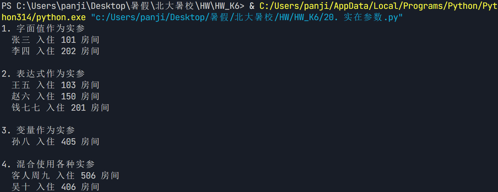

## 21. 参数的位置

请修改示例程序中checkin()函数的调用代码，改为位置实参和关键字实参混合调用，如一个位置实参、一个关键字实参，并变换参数位置，看看在什么情况下会触发错误。

```python
def checkin(hotel, leader):
    print(f"在地图搜索{hotel}")
    print(f"打车前往{hotel}")
    print(f"由{leader}到前台办理入住手续")
    print("-" * 30)

# 正确示例：位置+关键字混合调用
print("【正确示例】")
checkin("星城酒店", leader="小王")

# 错误1：语法错误，关键字在前、位置在后
checkin(hotel="星城酒店", "小王")

# 错误2：参数重复赋值
checkin("星城酒店", hotel="蓉城酒店")

# 错误3：关键字参数名不存在
checkin("星城酒店", name="小王")
```

(运行结果截图)
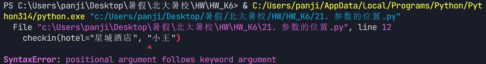
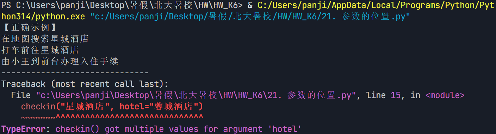
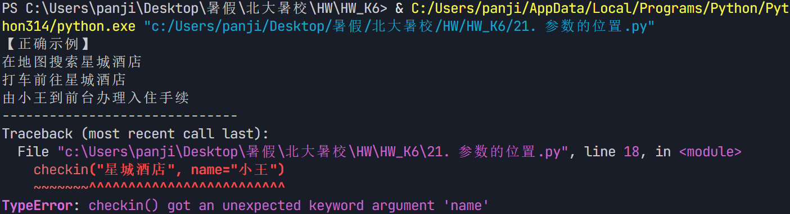

## 22. print默认参数

请编写程序，将1～20打印在同一行，数字之间用逗号隔开。形如“1,2,3,4,...,20”这样。

```python
print(*range(1, 21), sep=',')
```

(运行结果截图)
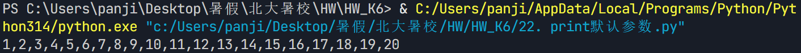

## 23. 函数返回值

请修改示例程序，将折扣作为bill()函数的参数，让函数直接返回折扣后的金额。

```python
def bill(items, discount=1.0):
    """
    结算账单函数
    参数:
        items: 点餐列表（字符串列表）
        discount: 折扣（1.0 为无折扣，0.85 为八五折），默认 1.0
    返回:
        折扣后的总金额
    """
    menu = {
        "小面": 10, "担担面": 12, "牛肉粉": 16, "米饭": 2,
        "毛血旺": 48, "酸菜鱼": 32, "口水鸡": 26, "烤鱼": 68,
        "小龙虾": 38, "水煮牛肉": 32, "泡椒牛蛙": 39, "辣子鸡": 32,
        "气泡水": 8, "椰奶": 6, "听可乐": 5, "扎啤": 20,
    }
    total = 0
    for item in items:
        if item in menu:
            total += menu[item]

    return total * discount

order = ["小面", "口水鸡", "烤鱼", "气泡水"]
original_total = bill(order)
discounted_total = bill(order, discount=0.85)

print("点餐:", order)
print("原价金额：{:.2f} 元".format(original_total))
print("折扣金额：{:.2f} 元".format(discounted_total))

print("\n=== 不同折扣对比 ===")
for d in [1.0, 0.95, 0.9, 0.85, 0.8]:
    print("  折扣 = {:.0%} → {:.2f} 元".format(d, bill(order, d)))
```

(运行结果截图)
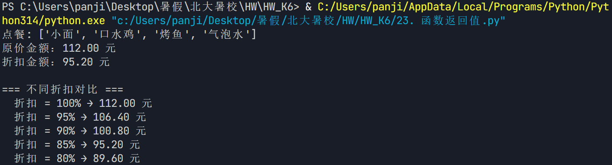

## 24. 合并代码

请将本节示例程序与上节的结账程序合并在一起，完成随便点单和结账的完整功能。

```python
import random

menu = {
    "主食": {"小面": 12, "担担面": 15, "牛肉粉": 18, "米饭": 2},
    "热菜": {
        "毛血旺": 38, "酸菜鱼": 45, "口水鸡": 32, "烤鱼": 58,
        "小龙虾": 68, "水煮牛肉": 48, "泡椒牛蛙": 52, "辣子鸡": 42
    },
    "饮料": {"气泡水": 8, "椰奶": 10, "听可乐": 5, "扎啤": 15}
}

price_all = {}
for category in menu.values():
    price_all.update(category)


def whatever(count=1):
    """随便套餐函数：随机生成订单，返回菜品列表"""

    hot_dishes = random.sample(list(menu["热菜"].keys()), count)
    staple = random.choice(list(menu["主食"].keys()))
    drink = random.choice(list(menu["饮料"].keys()))

    order = hot_dishes.copy()
    order.append(staple)
    order.append(drink)
    return order


def checkout(order):
    """结账函数：接收订单列表，打印明细并返回总金额"""
    total = 0
    print("===== 消费明细 =====")
    for dish in order:
        price = price_all[dish]
        print(f"{dish}\t{price} 元")
        total += price
    print("====================")
    print(f"应付总计：{total} 元\n")
    return total

print("随便套餐！")

# 小王点单（默认1道热菜）+ 结账
order_wang = whatever()
print("小王点了", order_wang)
checkout(order_wang)

# 小佩点单（2道热菜）+ 结账
order_pei = whatever(2)
print("小佩点了", order_pei)
checkout(order_pei)

# 小明点单（2道热菜）+ 结账
order_ming = whatever(2)
print("小明点了", order_ming)
checkout(order_ming)
```

(运行结果截图)
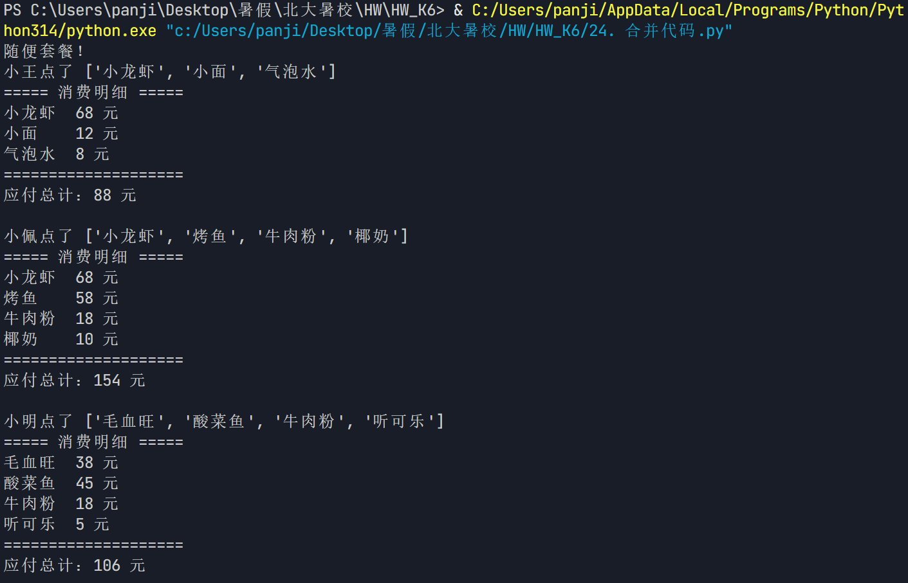

## 25. 避免副作用

将字面值、表达式或容器的拷贝（如列表切片）作为实参传递给函数，也能有效避免被不知底细的函数修改实参值。
请试着将上面示例中具有副作用的my_order2()函数的实参换成order的切片拷贝“order[:]”，验证副作用的消失效果。

```python
def my_order2(order):
    """有副作用的函数：直接在传入的列表上操作"""
    order.append("加蛋")
    order[0] = "辣子鸡"
    return sum({"小面": 10, "辣子鸡": 32, "加蛋": 2}.get(i, 0) for i in order)


print("=== 1. 有副作用：直接传 order ===")
order = ["小面", "口水鸡"]
print("调用前 order:", order)
total = my_order2(order)
print("调用后 order:", order) 
print("账单金额:", total)

print("\n=== 2. 无副作用：传 order[:] 切片拷贝 ===")
order = ["小面", "口水鸡"]
print("调用前 order:", order)
total = my_order2(order[:])
print("调用后 order:", order)
print("账单金额:", total)

print("\n=== 3. 原理：order 与 order[:] 是两个不同的列表对象 ===")
order = ["小面", "口水鸡"]
copy = order[:]
print("order:", id(order), order)
print("copy : ", id(copy), copy)
print("order is copy ?", order is copy)

```

(运行结果截图)
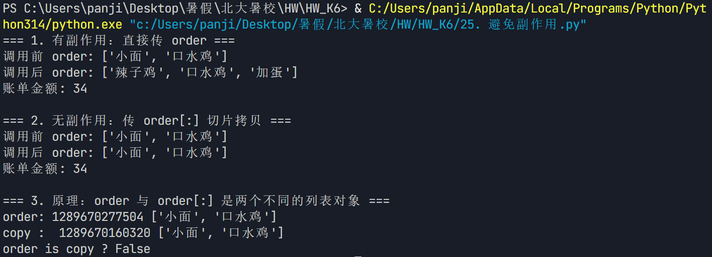

## 26. 如何改变实参

请结合前面的“避免改变函数参数”小节内容，理解在函数内改变函数外实参值的途径和机制。

（请写出你的答案）
### 一、核心机制：Python 的参数传递是"对象引用传递"

Python 中函数参数传递的是**对象的引用**（对象的内存地址），而不是值的拷贝。
函数内形参与外部实参**指向同一个对象**，但是否能"改掉"外部实参，取决于对象的**可变性**。

### 二、两种对象的区别

| 对象类型 | 可变性 | 例子 |
|---------|--------|------|
| **可变对象** | 可变（能在原对象上修改） | list、dict、set |
| **不可变对象** | 不可变（修改会创建新对象） | int、float、str、tuple |

### 三、在函数内改变函数外实参的途径

#### 途径 1：传入可变对象 + 在函数内"原地修改" ✅ 能改变外部实参

```python
def add_item(lst):
    lst.append("新元素")   # 原地修改，不创建新对象

order = ["小面"]
add_item(order)
print(order)   # ['小面', '新元素']  ← 外部实参被改变
```
**机制**：`lst` 和 `order` 指向**同一个列表对象**，`append` 是原地操作，
改的就是这个共享对象，所以外部 `order` 也变了。这就是第25题里 `my_order2` 产生副作用的原因。

#### 途径 2：传入不可变对象 / 在函数内"重新赋值" ❌ 不能改变外部实参

```python
def add_one(x):
    x = x + 1     # 重新赋值，x 指向了新的整数对象

n = 10
add_one(n)
print(n)        # 10  ← 外部实参没变
```
**机制**：整数是不可变对象，`x = x + 1` 相当于让形参 `x` 指向一个**新的整数对象 11**，
但外部 `n` 依然指向原来的 `10`。形参和实参从此"分道扬镳"。

#### 途径 3：传入可变对象，但在函数内"重新赋值" ❌ 也不能改变外部实参

```python
def reset(lst):
    lst = []       # 重新赋值，lst 指向了新的空列表

order = ["小面"]
reset(order)
print(order)    # ['小面']  ← 外部实参没变
```
**机制**：虽然传的是可变对象，但 `lst = []` 让形参指向了**新的空列表**，
外部 `order` 依然指向原对象。所以"重新赋值"永远改不了外部实参。

### 四、总结：改变外部实参的两个必要条件

1. 实参必须是**可变对象**（list、dict、set 等）
2. 函数内必须**原地修改**该对象（如 `lst.append()`、`lst[0] = ...`、`d[key] = val`），
   而不是对形参**重新赋值**

### 五、第25题"切片拷贝"为何能消除副作用

`order[:]` 创建了一个**新的列表对象**（内容相同但地址不同），传给函数的是这个副本。
函数内无论怎么原地修改，改的都是副本，原 `order` 不受影响。
从对象 `id()` 不同也能验证：`order is order[:]` 为 `False`。

### 六、如何"既想改变外部实参，又想避免意外副作用"

- 需要改变外部实参 → 用可变对象 + 原地修改
- 不想被函数改变 → 传切片拷贝 `order[:]`、`order.copy()`、`list(order)`，
  或传不可变对象（如把列表转成 tuple）

---

## 验证代码

```python
# 途径1：可变对象 + 原地修改 → 能改变外部实参
def add_item(lst):
    lst.append("新元素")

order = ["小面"]
add_item(order)
print(order)   # ['小面', '新元素']


# 途径2：不可变对象 / 重新赋值 → 不能改变外部实参
def add_one(x):
    x = x + 1

n = 10
add_one(n)
print(n)       # 10


# 途径3：可变对象 + 重新赋值 → 也不能改变外部实参
def reset(lst):
    lst = []

order = ["小面"]
reset(order)
print(order)
```

## 27. 全局变量

不同的函数内部可以通过global语句引用相同的全局变量，这也是在函数之间共享数据的一种常用方法。
相比通过参数来共享数据，使用全局变量有什么利弊？

（请写出你的答案）
### 一、利

- 简单、直接
- 可以在多个函数之间共享数据

### 二、弊

- 全局变量容易被修改，导致代码难以维护
- 全局变量在函数之间传递时，需要额外的参数传递

## 28. 参数的作用

请修改示例程序，让麻辣烫保持八五折，而饮料不打折，计算优惠后的金额。

```python
def bill_skewer(count, discount):
    total = 10 * count * discount
    return total

def bill_drink(count):
    total = 6.5 * count
    return total

discount = 0.85
skewer, drink = 6, 2

total = bill_skewer(skewer, discount) + bill_drink(drink)

print(f"您点了{skewer}串麻辣烫，{drink}瓶饮料。")
print(f"优惠后金额为{total:.2f}元。")
```

(运行结果截图)
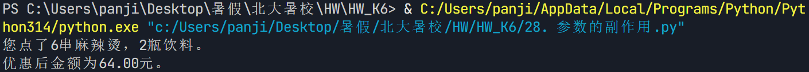