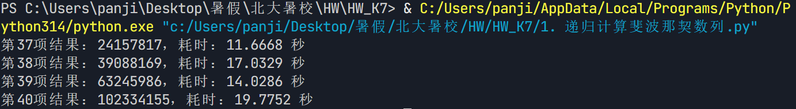
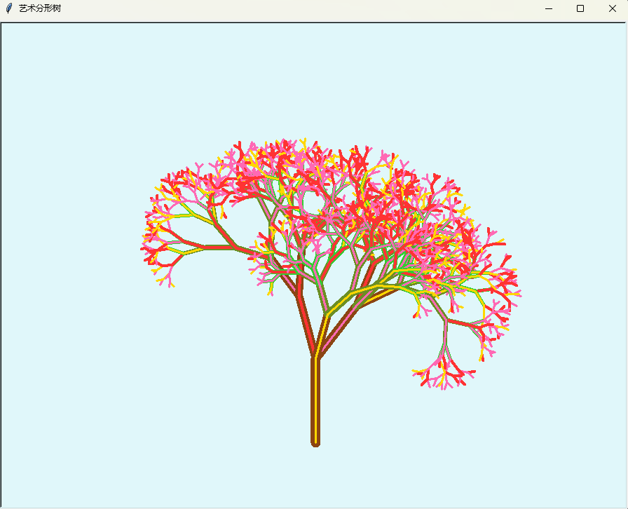
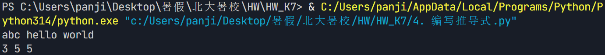
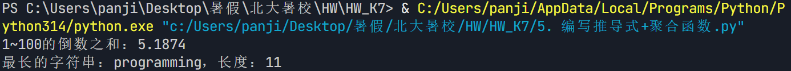
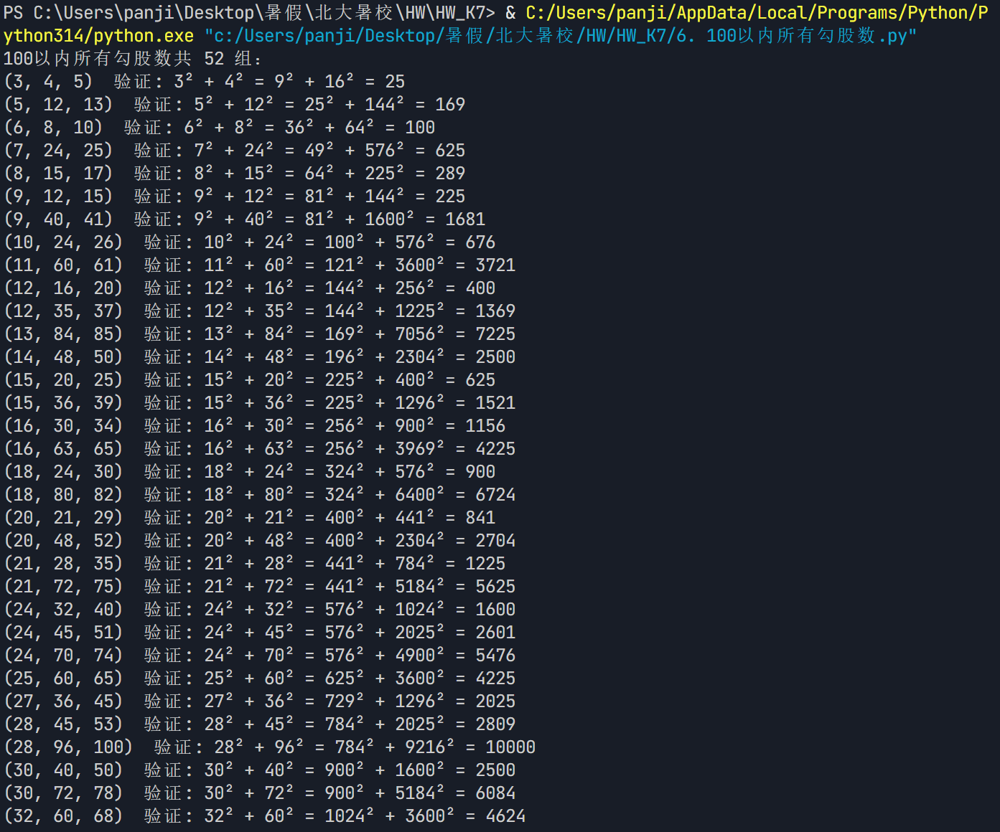
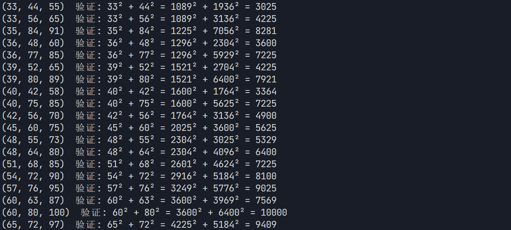
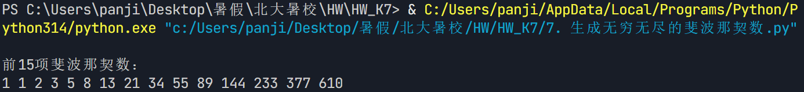

# 【K7】函数进阶

## 1. 递归计算斐波那契数

在普通的计算机上运行求斐波那契数的递归函数，示例程序中的前16项都可以很快得到结果。但随着n的增加，计算时间迅速变长。
试着计算第37、38、39、40项，看看你的计算机大概需要多少时间能得到结果？
这个递归函数的重复计算体现在哪里？

```python
import time

def fib(n):

    if n == 1 or n == 2:
        return 1
    return fib(n - 1) + fib(n - 2)

for n in range(37, 41):
    start = time.perf_counter()
    result = fib(n)
    end = time.perf_counter()
    print(f"第{n}项结果：{result}，耗时：{end - start:.4f} 秒")
```

(运行结果截图)


## 2. 艺术分形树

自由创作题，修改分形树程序，增加如下功能：
- 树枝的粗细可以变化，随着树枝缩短，也相应变细
- 树枝的颜色可以变化，当树枝非常短的时候，使之看起来像树叶的颜色，或者花、果；
- 让树枝倾斜角度在一定范围内随机变化，如15～45度之间，左右倾斜也可不一样，做成你认为最好看的样子
- 树枝的长短也可以在一定范围内随机变化，使得整棵树看起来更加逼真

```python
# -*- coding: utf-8 -*-
"""
第2题：艺术分形树
使用 turtle 递归绘制一棵带有随机变化、颜色渐变、粗细变化的艺术分形树。

功能说明：
1. 树枝粗细随递归深度变细（pensize 与 depth 成正比）。
2. 树枝颜色随长度变化：主干棕色 -> 中段橄榄绿 -> 树梢嫩绿 -> 末端花/果。
3. 倾斜角度在 15~45 度范围内随机变化，左右可不同。
4. 树枝长度在一定范围内随机变化（0.65~0.85 倍），使整棵树更逼真。
"""

import turtle
import random


def draw_tree(t, branch_len, depth):
    """
    递归绘制分形树
    :param t: turtle 画笔对象
    :param branch_len: 当前树枝长度
    :param depth: 递归深度（用于控制粗细、颜色和终止条件）
    """
    # 终止条件：树枝过短或深度耗尽，则在末端绘制"花/果"
    if branch_len < 10 or depth <= 0:
        choice = random.random()
        if choice < 0.5:
            t.pencolor("#FF69B4")  # 粉色花
            t.pensize(3)
        elif choice < 0.8:
            t.pencolor("#FF3333")  # 红色果
            t.pensize(4)
        else:
            t.pencolor("#FFD700")  # 金黄花朵
            t.pensize(3)
        t.forward(branch_len)
        t.backward(branch_len)
        return

    # 1) 粗细变化：树枝越深越细
    t.pensize(max(1, depth * 1.5))

    # 2) 颜色变化：根据长度过渡 棕褐 -> 橄榄绿 -> 嫩绿
    if branch_len > 60:
        t.pencolor("#8B4513")   # 树干：棕褐色
    elif branch_len > 30:
        t.pencolor("#6B8E23")   # 树枝：橄榄绿
    else:
        t.pencolor("#32CD32")   # 树梢：嫩绿色

    # 3) 长度随机变化：子枝为当前长度的 0.65~0.85 倍
    len_factor = random.uniform(0.65, 0.85)

    # 绘制当前树枝
    t.forward(branch_len)

    # 4) 角度随机变化：左右倾斜角度在 15~45 度间随机
    left_angle = random.randint(15, 45)
    right_angle = random.randint(15, 45)

    # 左侧树枝
    t.left(left_angle)
    draw_tree(t, branch_len * len_factor, depth - 1)

    # 右侧树枝：先回到原方向，再向右转
    t.right(left_angle)
    t.right(right_angle)
    draw_tree(t, branch_len * len_factor, depth - 1)

    # 复位到原方向（朝上）
    t.left(right_angle)

    # 有时加第三个中间小分支，使树更茂密（30% 概率）
    if random.random() < 0.3:
        mid_angle = random.randint(-15, 15)
        t.left(mid_angle)
        draw_tree(t, branch_len * len_factor * 0.7, depth - 1)
        t.right(mid_angle)

    # 回到当前树枝起点
    t.backward(branch_len)


def main():
    # 初始化画布
    screen = turtle.Screen()
    screen.setup(width=900, height=700)
    screen.bgcolor("#E0F7FA")   # 浅蓝色天空背景
    screen.title("艺术分形树")
    screen.colormode(255)

    # 初始化画笔
    t = turtle.Turtle()
    t.speed(0)            # 最快速度
    t.hideturtle()        # 隐藏画笔箭头
    t.penup()
    t.goto(0, -250)       # 从画布底部开始绘制
    t.setheading(90)      # 朝向上方
    t.pendown()

    # 设置随机种子（注释掉后每次运行效果不同）
    random.seed(42)

    # 开始递归绘制：初始长度 120，递归深度 9 层
    draw_tree(t, 120, 9)

    print("分形树绘制完成！点击画布关闭窗口。")
    screen.exitonclick()


if __name__ == "__main__":
    main()
```

(运行结果截图)


## 3. 区分打包和元组参数

对比一个“打包的”形参和一个接受元组的形参
请问：它们在函数定义和调用上有什么异同？

（请写下你的答案）
## 一、相同点

1. **函数内部都把数据当作元组使用**：两者在函数体内都可以用 `for x in ...`、索引 `...[0]`、`len(...)` 等元组操作。
2. **都可以处理不定数量的多个值**，只是数据组织方式不同。
3. **都能通过解包语法 `*` 来传参**，例如 `f(*lst)`。

## 二、不同点

### 1. 函数定义上的不同

```python
# (a) 打包形参：用 * 前缀
def f_packed(*args):
    print(type(args), args)

# (b) 接收元组的形参：普通形参，只是恰好当元组用
def f_tuple(t):
    print(type(t), t)
```

- `*args` 在**定义时**由 Python 自动把传入的若干个位置参数"打包"成一个元组，是语言层面的机制。
- `t` 只是一个普通形参，它本身不会自动打包；是否成为元组，完全取决于调用者传进来的是什么。

### 2. 函数调用上的不同

```python
f_packed(1, 2, 3)        # ✓ 多个值直接传入，自动打包成 (1, 2, 3)
f_packed()               # ✓ 可以不传，得到空元组 ()
f_packed(1)              # ✓ 只传一个也行

f_tuple(1, 2, 3)         # ✗ 报错！只接收 1 个参数却给了 3 个
f_tuple((1, 2, 3))       # ✓ 必须把元组作为一个整体传入
f_tuple([1, 2, 3])       # ✓ 传列表也行（函数内当序列用）
f_tuple()                # ✗ 报错！缺少必填参数
```

**核心区别**：
- 打包形参 `*args`：调用时**可以传任意多个位置参数**（包括 0 个），由解释器自动聚合成元组。
- 接收元组的形参 `t`：调用时**必须传且只传一个对象**，这个对象本身要是元组（或序列）。

### 3. 参数个数与解包的差异

```python
def f_packed(*args): ...
def f_tuple(t): ...

lst = [1, 2, 3]

f_packed(*lst)    # 等价于 f_packed(1, 2, 3)，args = (1, 2, 3)
f_tuple(lst)      # 直接把列表作为一个对象传入，t = [1, 2, 3]
f_tuple(*lst)     # 等价于 f_tuple(1, 2, 3)，会报错：参数个数不符
```

- 对 `*args` 用 `*lst` 是"解包再打包"，结果仍是元组 `(1,2,3)`。
- 对普通形参 `t` 用 `*lst`，等于把列表拆成 3 个位置参数，但 `f_tuple` 只接受 1 个，因此报错。

### 4. 与其他参数搭配时的表现

```python
def f_packed(a, *args): ...   # args 收集 a 之后的剩余位置参数
def f_tuple(a, t): ...        # t 只是第二个普通必填参数
```

打包形参常用于"吸收多余的位置参数"，而接收元组的形参只是一个固定位置的必填参数。

## 4. 编写推导式

编写程序，输入以空格隔开的一些字符串，输出这些字符串的长度
如：输入abc hello world
输出3 5 5

```python
words = input().split()
print(' '.join(str(len(word)) for word in words))
```

(运行结果截图)


## 5. 编写推导式+聚合函数

1. 求1～100的倒数之和（使用推导式和聚合函数sum）
2. 有一个字符串列表，请找到其中最长的字符串（使用推导式和聚合函数max）

```python
total = sum(1 / i for i in range(1, 101))
print(f"1~100的倒数之和：{total:.4f}")

str_list = ["abc", "hello", "world", "python", "hi", "programming"]

longest_str = max((len(s), s) for s in str_list)[1]
print(f"最长的字符串：{longest_str}，长度：{len(longest_str)}")
```

(运行结果截图)


## 6. 100以内所有勾股数

编写一个推导式，生成包含100以内所有勾股数(i,j,k)的列表

```python
pythagorean = [(i, j, k)
              for i in range(1, 101)
              for j in range(i + 1, 101)
              for k in range(j + 1, 101)
              if i * i + j * j == k * k]

print("100以内所有勾股数共 %d 组：" % len(pythagorean))
for triple in pythagorean:
    i, j, k = triple
    print("(%d, %d, %d)  验证: %d² + %d² = %d² + %d² = %d" % (i, j, k, i, j, i*i, j*j, k*k))
```

(运行结果截图)



## 7. 生成无穷无尽的斐波那契数

编写一个生成器函数，能够生成无穷无尽的斐波那契数列

```python
def fibonacci():
    """无穷斐波那契数列生成器"""
    a, b = 1, 1
    while True:
        yield a
        a, b = b, a + b

fib_gen = fibonacci()

print("前15项斐波那契数：")
for _ in range(15):
    print(next(fib_gen), end=" ")
```

(运行结果截图)
