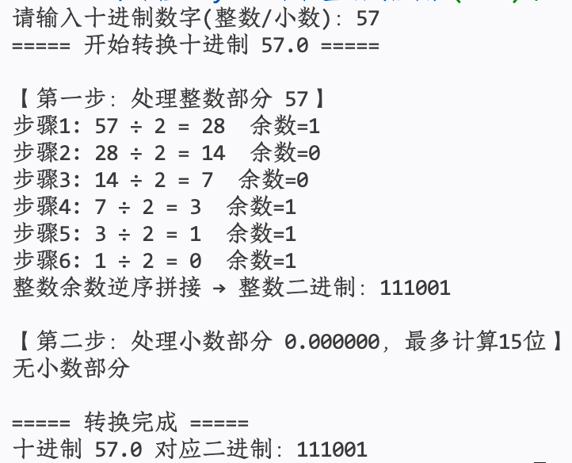
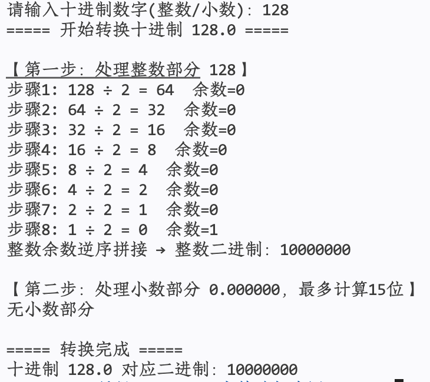
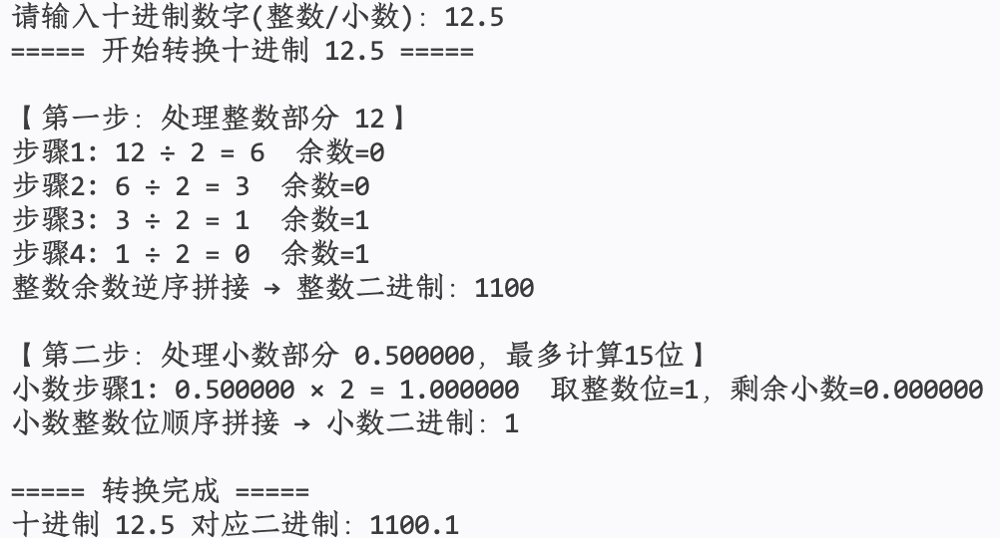
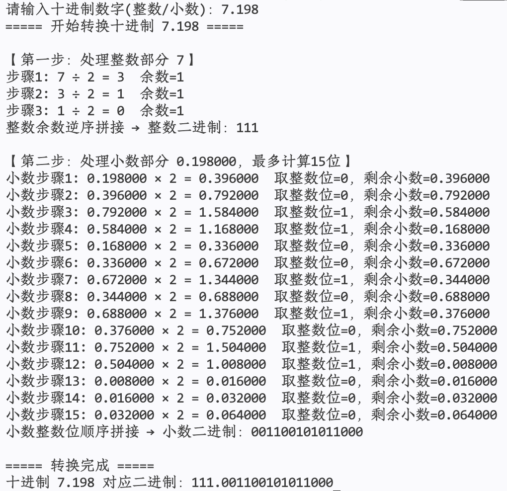
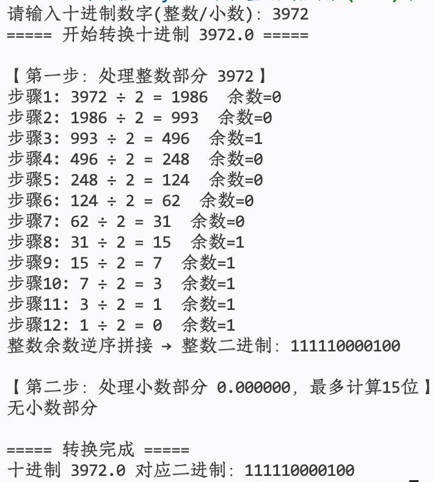
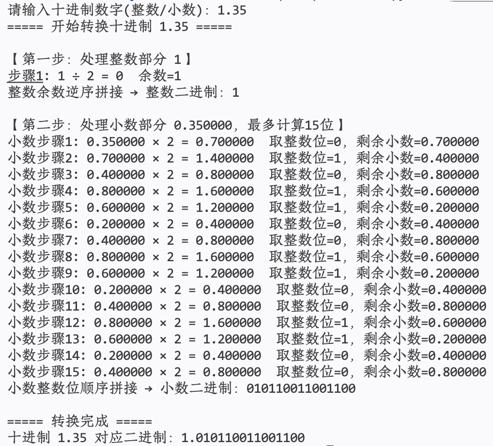
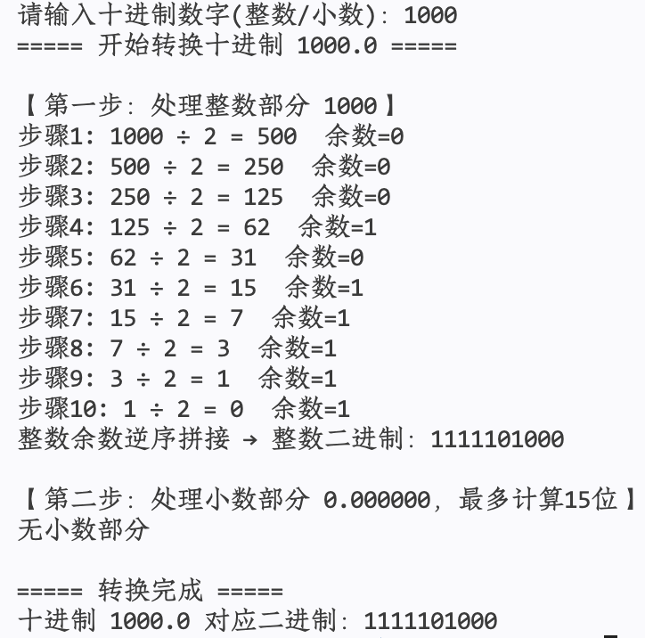

# 这里作业的主体内容
- 根据作业说明，逐项对应作业内容；
- 每道小题用一个一级标题“#”表示，后面跟着小题的序号，例如“# 1”、“# 2”等。
- 答案包含源代码的，需要在代码块中展示。
- 答案包含运行结果截图的，需要用系统截图（请勿用手机对屏幕拍照），嵌入在markdown文本中。
- 最后导出为pdf文件（content.pdf）提交。

# 1. 将下列十进制数（含小数）转换为二进制数

## 运行结果截图
- 57，128，12.5，7.198，3972，1.35，1000









## Python代码

```python
def decimal_to_binary_with_steps(num: float):
    print(f"===== 开始转换十进制 {num} =====\n")
    integer_part = int(num)
    fractional_part = num - integer_part
    all_steps = []

    # 1. 转换整数部分：除2取余，逆序
    print(f"【第一步：处理整数部分 {integer_part}】")
    if integer_part == 0:
        bin_int = "0"
        print("整数为0，二进制整数部分：0\n")
    else:
        temp_int = integer_part
        remainders = []
        step_count = 1
        while temp_int > 0:
            rem = temp_int % 2
            new_temp = temp_int // 2
            remainders.append(str(rem))
            print(f"步骤{step_count}: {temp_int} ÷ 2 = {new_temp}  余数={rem}")
            temp_int = new_temp
            step_count += 1
        bin_int = "".join(reversed(remainders))
        print(f"整数余数逆序拼接 → 整数二进制：{bin_int}\n")

    # 2. 转换小数部分：乘2取整，顺序，最多15位精度
    precision = 15
    print(f"【第二步：处理小数部分 {fractional_part:.6f}，最多计算{precision}位】")
    bin_frac = ""
    temp_frac = fractional_part
    step_count = 1
    if temp_frac > 0:
        while temp_frac > 1e-10 and len(bin_frac) < precision:
            product = temp_frac * 2
            bit = int(product)
            new_frac = product - bit
            bin_frac += str(bit)
            print(f"小数步骤{step_count}: {temp_frac:.6f} × 2 = {product:.6f}  取整数位={bit}，剩余小数={new_frac:.6f}")
            temp_frac = new_frac
            step_count += 1
        print(f"小数整数位顺序拼接 → 小数二进制：{bin_frac}\n")
    else:
        print("无小数部分\n")

    # 3. 拼接最终结果
    if bin_frac:
        final_bin = f"{bin_int}.{bin_frac}"
    else:
        final_bin = bin_int
    print(f"===== 转换完成 =====")
    print(f"十进制 {num} 对应二进制：{final_bin}")
    return final_bin


if __name__ == "__main__":
    try:
        user_input = input("请输入十进制数字(整数/小数)：")
        number = float(user_input)
        decimal_to_binary_with_steps(number)
    except ValueError:
        print("输入非法！请输入数字，如 13、5.625、0.2")
```
